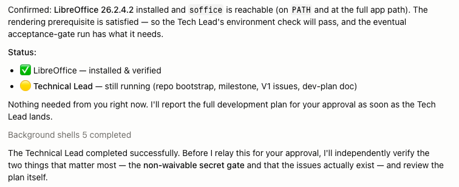

# Human-Codex Process

Use AI agents like a delivery team, not like a magic text box.

<p align="center">
  
</p>

Human-Codex Process is a practical operating system for AI-assisted software
delivery. It helps experienced product and engineering teams move faster with
AI while keeping the parts that make software reliable: clear product intent,
architecture, tests, QA, release gates, operational readiness, and human
decision points.

The promise is not that AI lets us skip professional software development. The
promise is that AI can now help perform much more of that work.

The core idea is simple:

```text
Role controls authority.
Product controls intent.
Technology controls technique.
Theme controls visual identity.
```

That separation lets agents move quickly without giving them silent authority
over scope, implementation, validation, release, and production risk.

The otter mascot is there for a reason: this process is serious about software
delivery, but it is also meant to make modern AI work feel sharper, faster, and
more alive for the people already doing the craft.

## Why Try It

Most AI coding workflows are optimized for prompt-to-diff work. That is useful,
but it does not solve product delivery. Real software work needs shared memory,
good decisions, quality gates, evidence, and clear ownership.

Human-Codex Process is built for the moment when a team says:

- "AI is useful, but the output quality is inconsistent."
- "The agent did the task, but it lost the product thread."
- "It worked in the first chat, then another agent missed half the context."
- "It overbuilt, got stuck, or spent hours heading in the wrong direction."
- "We still need architecture, tests, QA, and release discipline. Who creates
  and checks those now?"

This process turns agent work into a delivery system:

- Product intent is written down before implementation starts.
- UX, architecture, and technical planning scale to the risk of the work.
- Development uses TDD evidence, not just claims that tests pass.
- QA validates pushed branches independently from developer workspaces.
- Release promotes only tested and approved commits.
- Production and non-production runtime worlds stay physically separated.
- Every handoff leaves an artifact instead of relying on chat memory.

It is intentionally procedural, but not heavy by default. A tiny defect can use
inline issue notes. A personal tool can use a compact brief and scoped
architecture. A production service can require the full chain: brief, UX,
architecture, development plan, QA evidence, release manifest, staged
deployment, and operations readiness.

## What This Solves

Unstructured "vibe coding" can feel fast while quietly creating delivery risk.
One chat may remember the product intent, but that memory is not automatically
shared across agents, roles, workspaces, or future sessions. Decisions get
lost, context drifts, and products fail for familiar reasons: unclear scope,
weak architecture, missing tests, poor validation, and unmanaged release risk.

This process makes professional software practices explicit enough for agents
to execute:

- Product context becomes shared documentation instead of private chat memory.
- UX, architecture, development, QA, release, and operations keep separate
  responsibilities.
- Gates and evidence let humans steer the work without micromanaging every
  edit.
- Guardrails prevent agents from overbuilding, spinning on empty, or drifting
  away from the approved intent.

The leverage comes from automation, not omission. AI reduces workload by
helping perform the professional steps, not by pretending the steps are
optional.

<p align="center">
  
</p>

## What This Does Not Replace

This process does not replace actual knowledge of professional software
development. It helps automate professional practice; it does not make the
practice unnecessary.

People who do not know what good product definition, architecture, testing, QA,
release discipline, or operations readiness look like will still struggle to
judge the output. The likely gain is not that anyone can now build reliable
software without expertise. The likely gain is that skilled teams can shorten
development cycles, produce more software, and raise consistency by making
their expectations explicit and reusable.

In short: this is for people who already care about building software well and
want AI to help them do more of it.

## Best First Trial

Do not start by trying to transform your whole delivery process. Start with one
real slice of work:

- small enough to finish;
- important enough that quality matters;
- concrete enough to define acceptance criteria;
- visible enough that the team can judge the result.

Good candidates are internal tools, narrow product features, repeatable defect
streams, documentation-heavy technical changes, or operational work where
evidence matters. Run one release through the process, then ask whether the
work was easier to review, easier to trust, and easier to continue than a
normal prompt-driven coding session.

## How Work Is Coordinated

The process is multi-channel enabled. One role can coordinate other roles or
subprocesses in parallel, while approval gates stay controlled.

That is where this becomes more than a prompt pattern. A Product Owner can ask
UX and Architecture to work in parallel, then return with questions or
approval-ready documents. Later, Technical Lead planning and Operations
planning can run side by side while the Product Owner keeps one controlled
status thread with the human operator.



<p align="center">
  
</p>

The important pattern is that parallel work does not mean uncontrolled work.
Each channel has a role, a lane, a handoff artifact, and a clear return point.

Work is divided across four dimensions.

### Role

The role defines authority: what an agent is allowed to decide, edit, validate,
or promote. Role boundaries prevent a single agent from silently changing
scope, implementation, validation, and release state in one pass.

### Product

The product profile defines intent: vision, roadmap, domain language,
acceptance criteria, repositories, deployment targets, and accumulated product
memory. Product context does not grant permissions by itself.

### Technology

Technology profiles define technique: test commands, lint commands, packaging
rules, style conventions, security practices, and stack-specific failure modes.
Technology guidance tells an authorized role how to work correctly; it does not
authorize that role to cross process boundaries.

### Theme

Theme profiles define visual identity: tokens, typography, color modes,
component styling, layout shells, examples, and provenance. Theme guidance
tells a visual surface what it should feel like across single-page HTML docs,
API platforms, dashboards, internal tools, and product UIs. It does not decide
product scope, architecture, or implementation technology.

A concrete agent profile is assembled from these pieces:

```text
role profile
+ product profile
+ one or more technology profiles
+ theme profile when the work has a visual surface
```

Example:

```text
agent: product-python-developer
role: agents/developer
product: products/product-name
technology:
  - technologies/python
theme:
  - themes/leantime-inspired
```

## Lifecycle

The default lifecycle is:

1. Product Owner defines what to build, why it matters, scope boundaries, and
   acceptance criteria.
2. UX Design Lead defines the structural experience: flows, commands, screens,
   states, accessibility, and design-to-architecture implications.
3. Architect records technical direction, boundaries, constraints, risks, and
   verification expectations where architecture review is needed.
4. Technical Lead turns accepted product, UX, and architecture inputs into
   executable GitHub Issues, sequences work, prepares environments, and marks
   only process-ready issues `ready-for-dev`.
5. Developer implements one `ready-for-dev` issue at a time in `dev/**` using
   TDD: focused failing test first, minimal passing implementation second,
   refactor only while tests stay green. For visible surfaces, the Developer
   implements through the selected theme's tokens and components.
6. QA validates the pushed branch in `tst/**`, checks CI and TDD evidence, runs
   acceptance, regression, accessibility, and theme-compliance checks, and
   records pass/fail evidence.
7. Release assembles only QA-passed work into `rel/**`, runs release-level QA,
   promotes validated source, deploys through approved gates, and tags only
   after production promotion.
8. Operations Lead owns production runtime health after release: monitoring,
   incidents, production credentials, TLS material, runbooks, and operations
   plan maintenance.

The lifecycle scales by artifact budget:

- `inline`: defect, tiny script, or issue-local change.
- `mini`: prototype or personal tool with narrow scope.
- `standard`: feature or product needing downstream UX or architecture.
- `full`: production, enterprise, regulated, or multi-actor product.

The process asks for the smallest artifact set that still protects the work.

## Install As A Codex Skill

This repository is meant to stay live and editable. Install it as a thin Codex
skill wrapper that points at the cloned repository. Do not copy the process
files into the skill; that would turn a living process into a stale snapshot.

To install it:

1. Open a terminal and choose the parent folder where you want the process
   repository to live.
2. Clone the repository:

```text
git clone <repository-url> <folder-name>
cd <folder-name>
```

3. In Codex, ask it to create a skill that points at this cloned repository in
   place.
4. Restart or reload Codex so the skill is discovered.
5. Verify the skill with a small prompt such as:

```text
$process role=PO Help me frame a mini product brief for a tiny habit tracker.
```

Use a prompt like this from inside the cloned repository:

```text
Create a Codex skill named `process` that I can invoke with `$process`.
Make it a thin wrapper around this checkout: do not copy repo content, and re-read the live files on each use.
Support role prompts like `role=PO`, `role=Developer`, `role=QA`, and show me the created `SKILL.md`.
```

If you create or move the checkout later, recreate or update the wrapper so it
points at the new checkout. The wrapper should be disposable; this repository is
the maintained source.

## How To Use This Process

Start with the outcome you need. Invoke the role that owns the next decision,
or keep one Product Owner control thread and let the Product Owner coordinate
the other roles.

- Need scope, acceptance criteria, or release inclusion? Start with Product
  Owner.
- Need flows, CLI shape, screen behavior, or accessibility? Use UX Design Lead.
- Need boundaries, dependencies, migrations, or security direction? Use
  Architect.
- Need issues sequenced and made ready for implementation? Use Technical Lead.
- Need code written for a ready issue? Use Developer.
- Need independent validation? Use QA.
- Need release assembly, promotion, and deployment evidence? Use Release.
- Need production runtime material, monitoring, or incidents handled? Use
  Operations Lead.

### Condensed PO-Led Flow

This is the practical way to run a small product when you want speed without
losing control. The human stays in one conversation, approves gates, and lets
the Product Owner coordinate the other roles.

1. Start with Product Owner:

```text
$process role=PO Interview me and create a product brief for <product>.
```

2. Approve the brief, then have the Product Owner coordinate discovery:

```text
I approve the brief. Engage the UX Lead and Architect as subprocesses and return with either questions or documents ready to approve.
```

3. Approve the documents, then request the release plan:

```text
I approve all docs. Coordinate development of a release with the Technical Lead and return with the development plan. Have the Operations Lead prepare the operations plan.
```

4. Approve planning, then let development run under Product Owner control:

```text
I approve the development plan and operations plan. Control development until the product is ready for deployment.
```

5. Review the developed product and release evidence:

```text
Review the developed product, verify tests passed, summarize outstanding defects, and prepare deployment approval.
```

6. Approve deployment, validate production, and close the release:

```text
I approve deployment. Have the product deployed in production and return when it is ready for validation.
```

After validation, tell the Product Owner to close the release.

### Direct Role Flow

Use this when you want to work with each role explicitly instead of having the
Product Owner coordinate the subprocesses. It is more verbose, but useful when
the team wants to inspect every role output before the next role starts.

```text
$process role=PO Create a mini product brief for a simple habit tracker.
```

```text
$process role=UX Using the accepted brief, define the main flow, screens,
states, accessibility expectations, and theme notes.
```

```text
$process role=Architect Using the brief and UX notes, produce a compact
architecture direction with storage, test boundaries, security assumptions, and
verification expectations.
```

```text
$process role=TL Convert the accepted brief, UX notes, and architecture
direction into ready-for-dev issues for the first release.
```

```text
$process role=Developer Implement the first ready-for-dev issue with TDD and
record failing-test, passing-rerun, and validation evidence.
```

```text
$process role=QA Validate the pushed branch, check acceptance criteria and TDD
evidence, run relevant regression checks, and record pass or fail evidence.
```

```text
$process role=Release Prepare a release for the QA-passed work, include only
approved issues, verify release evidence, and produce a release note.
```

### Before Code Starts

The process works best when every issue can answer four questions before code
starts:

1. What product outcome or defect record does this issue serve?
2. What observable acceptance criteria define done?
3. What technical constraints or architecture notes apply?
4. What focused test should fail first?

For visual work, add a fifth:

5. What theme, mode, and surface contract should the UI follow?

If those answers are available, agents can work with far less ambiguity and far
more useful autonomy.

## What Makes It Different

### It Anchors Every Session To Product Context

Every product folder carries a `product.md` context record: the durable link
between the product and its source repository, brief, theme, active milestone,
and lifecycle stage. The Product Owner creates it on first engagement and keeps
it current.

Every session starts with a Session Start Product Context Check. The active
agent identifies the target product and reads `product.md`. If it exists, the
agent restates the product context and continues. If it is missing, the Product
Owner has not established product context yet: a Product Owner session creates
the record, and any other role stops and recommends starting with the Product
Owner, unless the operator records a Product Owner exception for `inline` or
`mini` work. This removes the guesswork about which repository a session belongs
to and keeps the Product Owner as the reliable starting point.

### It Is Built For Agent Authority, Not Just Agent Output

The process assumes agents can take real action. That makes authority
boundaries non-negotiable. Each role has a lane, a tool surface, and explicit
stop conditions. Agents can move fast inside their lane, but handoffs require
evidence.

### It Makes The Filesystem Match The Process

Product folders use phase-specific checkouts:

```text
product/
  dev/   active development checkouts
  tst/   QA and release-test checkouts
  rel/   local release source checkouts
  architecture/
  agents/
  process/
  product.md   product context record (repo link, brief, theme, milestone, stage)
  README.md
```

Developers work in `dev/**`. QA validates in `tst/**`. Release operates in
`rel/**`. Promotion between phases is explicit and owned by the next role.

### It Treats TDD As Delivery Discipline

Developer work is test-driven. For every feature, defect fix, refactor, or
behavior change, the Developer records:

- the focused test added or updated;
- the expected failing run before production code changes;
- the minimal implementation;
- the passing focused rerun;
- broader relevant checks before QA handoff.

Technical Lead enforces TDD expectations before work starts. QA checks TDD
evidence before marking work `qa-passed`. Release checks that included issues
carry Developer TDD evidence or an explicit Technical Lead exception.

### It Gives Every Web Surface A Reusable Visual Identity

The process treats visual design as reusable infrastructure. A theme records
the look and feel once, then every HTML brief, architecture document, UX
document, API platform, dashboard, internal tool, and app UI can consume the
same token and component contract.

The default theme is `leantime-inspired`: an app-like visual identity derived
from Leantime's public theme implementation. It brings rounded operational
surfaces, blue/teal accents, compact work-management density, light/dark mode,
soft shadows, readable forms and tables, and accessible focus behavior into
Human-Codex outputs.

Themes are designed to be swappable. A product can start with
`leantime-inspired`, then later select another theme without rewriting the role
process, product brief structure, technology standards, or release workflow.

### It Separates Runtime Worlds

Production and non-production are separate runtime worlds. A product, tool,
service, worker, scheduler, CLI daemon, UI, API, or mutable runtime must not be
able to read, mutate, select, proxy, or manage both production and
non-production.

That separation must be enforced by real controls: service users, scoped
credentials, filesystem permissions, network bindings, databases, queues,
buckets, config roots, and runtime directories. Labels, route params, flags,
and operator discipline are not controls.

### It Preserves Human Decision Points

The process keeps human judgment where it belongs:

- Product scope and release contents are Product Owner decisions.
- Operator approval is required for defined handoff gates.
- Major production release decisions are not inferred by agents.
- Waivers are explicit records with scope, reason, approver, risk owner,
  expiry, and follow-up.

This lets agents execute without turning ambiguity into silent policy.

## Repository Structure

```text
.
  agents/        reusable role profiles and profile composition rules
  assets/        README images and lightweight repository media
  documents/     document specifications for briefs, UX, architecture, ops
  process/       operating process definitions and lifecycle rules
  security/      environment, secrets, and security follow-up notes
  technologies/  technology-specific engineering standards
  themes/        reusable visual identity themes for web surfaces
  tools/         canonical reusable tool manuals
  README.md      repository overview
```

## Repository Tour

### Agents

[agents/](agents/README.md) defines reusable role profiles.

Current role profiles:

- Product Owner
- UX Design Lead
- Architect
- Technical Lead
- Developer
- QA
- Release
- Operations Lead

Each role profile defines identity, authority, boundaries, tool access,
handoffs, recurring checks, and interaction style. The profile files are
deliberately repetitive in the places that matter because agents often enter
through different surfaces. The canonical process remains in `process/**`, and
the role profiles mirror the rules an agent must remember at runtime.

### Process

[process/](process/overview.md) defines how work moves from idea to production.

Current process definitions:

- [Overview](process/overview.md)
- [Product Owner](process/product-owner.md)
- [UX Design Lead](process/ux-design-lead.md)
- [Architect](process/architect.md)
- [Technical Lead](process/tech-lead.md)
- [Developer](process/developer.md)
- [QA](process/qa.md)
- [Release](process/release.md)
- [Operations Lead](process/operations-lead.md)
- [Product environments](process/environments.md)

The overview is the starting point. Role files define the authority,
responsibilities, workflow, evidence requirements, stop conditions, and handoff
rules for each stage.

### Documents

[documents/](documents/) defines the artifacts that carry intent and evidence
between roles.

Current document types:

- [Product Brief](documents/product-brief.md): product vision, goals, scope,
  acceptance criteria, roadmap, and release intent.
- [UX Design Document](documents/ux-design-document.md): user flows,
  interaction states, wireframes, accessibility, and design-to-architecture
  bridge.
- [Architecture Design Document](documents/architecture-design-document.md):
  system boundaries, components, contracts, risks, test-first expectations,
  and technical decisions.
- [Operations Plan](documents/operations-plan.md): deployment, monitoring,
  credentials, runbooks, readiness, and operational procedures.

Documents scale with the artifact budget. The process prefers a compact,
accurate issue note over a large template filled with filler.

### Technologies

[technologies/](technologies/README.md) defines stack-specific practices.

Current profile:

- [Python](technologies/python/README.md)

Technology profiles define how authorized agents should work in a stack: test
strategy, TDD order, validation commands, packaging, style, security, and
common failure modes. They are reusable across products.

### Themes

[themes/](themes/README.md) defines visual identity themes.

Current default theme:

- [Leantime Inspired](themes/leantime-inspired/README.md)

Themes contain design tokens, component guidance, layout shells, examples, and
upstream provenance. They are used whenever the process produces a visual web
surface: static HTML docs, API platforms, dashboards, internal tools, product
UIs, and browser-viewable process artifacts.

The selected theme is recorded in the product brief or UX design document for
`standard` and `full` work, or in the issue notes for smaller visual changes.
Developer implementation uses theme tokens before hard-coded visual values. QA
records visible theme drift as a defect unless the Product Owner accepts the
deviation.

### Tools

[tools/](tools/README.md) contains canonical reusable tool manuals.

Tool documentation uses two layers:

- Canonical `tools/*.md` files explain how a tool works.
- Role `TOOLS.md` files grant permission and point only to the manuals that
  role can use.

This prevents tool knowledge from becoming tool authority.

### Security And Environments

[security/](security/README.md) and
[process/environments.md](process/environments.md) define environment and
secret-handling expectations.

The most important rule is that production and non-production separation is not
waivable. Release evidence cannot rely on production credentials in
non-production, dummy TLS material, disabled certificate verification, browser
security exceptions, or fixture secrets masquerading as operational readiness.

## Adoption Notes

Do not adopt the entire system on day one. The useful starting set is:

1. Use role boundaries from `agents/**`.
2. Use the lifecycle and labels from `process/overview.md`.
3. Require TDD evidence from Developer.
4. Require QA to validate pushed branches, not developer workspaces.
5. Keep release promotion separate from development.
6. Enforce production/non-production runtime separation from the beginning.
7. Select a theme for every visual surface and implement through its tokens.

From there, add artifact depth as the product risk justifies it.

The goal is not to admire the process. The goal is to see whether AI-assisted
delivery becomes more consistent, reviewable, and useful when professional
software practice is made explicit.

## Launch Assets

The repository includes an 8-week public launch image set under
`assets/social/launch/imagegen/`. The images are designed to introduce the
process one idea at a time: delivery teams, quality systems, lifecycle,
parallel gates, team adoption, architecture, test evidence, and controlled
release.


## License

Unless a file or subdirectory says otherwise, the Human-Codex process material
in this repository is released under the MIT License. That includes the process
definitions, agent role profiles, document specifications, technology
profiles, tool manuals, and original Human-Codex theme-system documentation.

The `leantime-inspired` theme includes copied and adapted material from
Leantime. That upstream material is tracked separately under
`themes/leantime-inspired/upstream/`, with source commit, copied paths, and
license provenance recorded in
`themes/leantime-inspired/upstream/import-log.md` and
`themes/leantime-inspired/upstream/LICENSE.AGPL-3.0`.
