# Architecture Design Document Specification

This specification defines the standard structure, required content, depth
expectations, and diagram requirements for architecture design documents. It is
the authoritative reference an architect follows when documenting architecture
for any product, tool, workflow, service, report, or automation.

Every architecture design document produced under this process must follow this
specification. The scaling rules at the end define which sections are required
and which are optional based on document scope, product model, assurance level,
and architecture calibration.

---

## Document Scope Levels

Every architecture document declares one of two scope levels:

| Level | Purpose | Location | When to use |
| --- | --- | --- | --- |
| `full` | Durable product architecture documentation. | `architecture/` or approved product architecture documentation. | New product, major redesign, first-time documentation of an existing system, or any work with durable architectural value beyond a single issue. |
| `scoped` | Issue-local architecture note. | GitHub Issue comment, pull request, or linked document. | Single-issue architecture review where the decision does not warrant a standalone document. |

A `scoped` document may reference a `full` document instead of repeating stable
content. A `scoped` document must never contradict a `full` document without
explicitly recording the override and its rationale.

---

## 1. Document Header

Every architecture design document begins with a header containing these fields:

| Field | Required | Description |
| --- | --- | --- |
| Product | Always | Product or application name. |
| Scope level | Always | `full` or `scoped`. |
| Date | Always | Date of last substantive update. |
| Author | Always | Person or agent that produced the document. |
| Status | Always | `draft`, `review`, `accepted`, `superseded`. |
| Canonical path | Always | File path or URL where the authoritative version of this document lives. Every other copy is derived. |
| Related issues | When applicable | GitHub Issue numbers this document covers. |
| Supersedes | When applicable | Document or decision this replaces. When set, the superseded document must be updated to status `superseded` with a pointer to this document. |
| Superseded by | When applicable | Document that replaces this one. Set when this document is no longer current. |
| Related documents | When applicable | Links to other architecture documents, ADRs, or `scoped` notes that depend on or extend this document. |

Example:

```
Product:          Checkout Service
Scope level:      full
Date:             2026-07-02
Author:           Architect agent
Status:           draft
Canonical path:   architecture/checkout-service.md
Related issues:   #123, #124
Supersedes:       architecture/checkout-v1.md
```

### Document Lifecycle and Canonical Sources

Every architecture document has exactly one canonical location recorded in the
header. Agents and humans must read from the canonical path. Copies, summaries,
or extracts in issues, PRs, or other documents are not authoritative.

Rules for maintaining canonical integrity:

- When a `full` document is accepted, its canonical path is the source of truth
  for all architecture questions about that product or component.
- When a `scoped` note references a `full` document, it must use the `full`
  document's canonical path, not a copy.
- When a document is superseded, the superseding author must update the old
  document's status to `superseded` and add a `Superseded by` field pointing to
  the replacement. The old document must not be deleted until the replacement is
  accepted.
- When a `full` document is updated (not superseded), increment the date and
  record the change in the revision history appendix. Do not create a new
  document for incremental updates.
- A `scoped` note that introduces a decision which changes the `full` document
  must trigger an update to the `full` document. The `scoped` note records the
  decision; the `full` document absorbs it. The `scoped` note then references
  the updated `full` document section.
- Agents must verify that a document's status is `accepted` before treating its
  content as settled architecture. Documents in `draft` or `review` status are
  proposals, not commitments.

---

## 2. Context and Scope

This section establishes why the system exists, what it covers, and what
constrains the architecture. An architect who skips this section produces
decisions without grounding.

### 2.1 Business Context

State the problem the system solves, who it solves it for, and why it matters.
This is not a product brief restatement. It is the architect's interpretation of
the business need in terms that inform technical trade-offs.

Answer these questions:

- What business outcome does this system enable?
- Who are the primary users or consumers (human users, other systems, agents)?
- What happens if this system is unavailable or incorrect?
- What is the expected lifetime of this system?

### 2.2 System Boundary

Define what is inside the system and what is outside. Name every external actor
and external system the product interacts with. State the nature of each
interaction: who initiates, what protocol, what data crosses the boundary.

Identify trust boundaries. A trust boundary exists wherever data or control
crosses between zones with different levels of trust: between the public
internet and the application, between the application and a third-party API,
between authenticated and unauthenticated contexts, between user-owned data and
system-owned data. Mark every trust boundary on the system context diagram. Each
trust boundary must state what security controls enforce it (TLS, authentication,
authorization, input validation, network segmentation).

Produce a system context diagram:

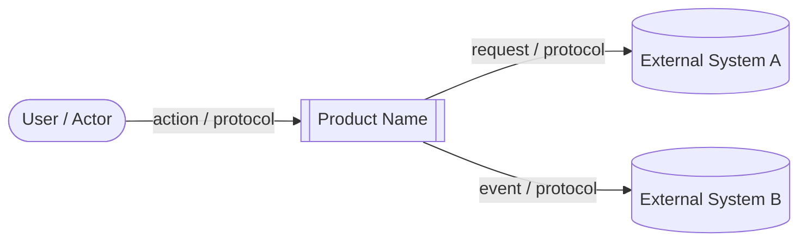

Adapt node shapes and labels to the actual system. Use `[[ ]]` for the system
under design. Use `([ ])` for human actors. Use `[( )]` for external systems
and data stores. Label every edge with the interaction type and protocol.

### 2.3 Stakeholders and Concerns

Identify stakeholders and the architecture concerns they carry. Stakeholders are
not limited to end users. They include operators, developers, compliance teams,
dependent systems, and the product owner.

| Stakeholder | Primary concern |
| --- | --- |
| End user | Responsiveness, correctness, privacy. |
| Operations | Deployability, observability, incident response. |
| Developer | Maintainability, testability, local dev experience. |
| Compliance | Data retention, audit trail, access control. |

Add or remove rows to match the actual product.

### 2.4 Constraints

Record every constraint that limits architectural choice. Categorize each
constraint:

- **Business**: budget, timeline, staffing, organizational structure.
- **Technical**: existing technology stack, platform limits, API rate limits,
  hardware constraints.
- **Security**: required encryption standards (at rest and in transit),
  authentication and authorization requirements, credential management
  obligations, network isolation requirements, compliance certifications
  (SOC 2, PCI DSS, HIPAA, GDPR), penetration testing or audit obligations.
- **Regulatory**: data residency, retention, encryption requirements, industry
  standards, right-to-erasure obligations, consent requirements, audit trail
  mandates.
- **Organizational**: team skills, approved technology list, vendor
  relationships, operational maturity.

For each constraint, state the constraint, its source, and how it shapes
architectural decisions. Do not list constraints that do not influence any
decision.

### 2.5 Assumptions and Dependencies

Record assumptions that the architecture relies on. An assumption is something
believed to be true but not verified. Each assumption must include what happens
if the assumption is wrong.

Record external dependencies: services, libraries, platforms, or teams the
system depends on that are outside the architect's control.

| Assumption | Risk if wrong |
| --- | --- |
| Database supports JSON columns. | Schema redesign and migration rework. |
| Peak traffic stays below 1000 req/s. | Scaling model must be revisited. |

| Dependency | Owner | Risk |
| --- | --- | --- |
| Identity provider (Keycloak). | Platform team. | Auth flow blocked if unavailable. |
| Payment gateway API. | External vendor. | Checkout flow blocked, needs fallback. |

### 2.6 Architecture Calibration Snapshot

Carry forward Product Owner and UX calibration and record the Architect's
interpretation:

| Field | Description |
| --- | --- |
| Product model | Product model from the accepted product brief. |
| Assurance level | Prototype, personal productivity, production grade, or enterprise/regulated. |
| Operator objective | Speed, robustness, exploration, launch readiness, delegation clarity, risk reduction, or other stated objective. |
| UX surface type | UX surface type from the accepted UX design document. |
| Architecture scope | Prototype, personal productivity, production grade, or enterprise/regulated architecture depth. |
| Architecture documentation depth | Minimal, focused, complete, or enterprise-depth. |
| Risk depth | Which risk categories are designed explicitly and which are recorded as deferred. |
| Security depth | Security treatment appropriate to assurance level and hard safety boundaries. |
| Operations depth | None/minimal, basic run support, production support, or enterprise operations depth. |
| Verification depth | Smoke/manual, focused automated checks, production-grade test expectations, or enterprise validation expectations. |
| Deferred architecture concerns | Concerns intentionally deferred because of product model, assurance level, or operator objective. |

If the product brief or UX design lacks enough calibration to choose
architecture depth, return it to the owning role unless the missing detail can
be safely inferred from durable context and recorded as an assumption.

### 2.7 Model-Specific Architecture Focus

Use the product model to decide which architecture questions matter.

For a `CLI Tool`, emphasize execution context, packaging, command dispatch,
filesystem and network access, configuration, credentials, idempotency,
logging, dependency boundaries, destructive-operation safeguards, and
verification depth appropriate to assurance level.

For an `ETL / Batch Job`, emphasize data boundaries, source/destination access,
transformation ownership, credentials, volume, idempotency, checkpointing,
replay/rollback, validation, monitoring, and recovery only to the selected
assurance depth.

For an `API / Service`, emphasize consumers, contracts, authentication and
authorization boundaries, error contracts, rate/volume expectations, backward
compatibility, observability, and operational support.

For a `Workflow / BPM Platform`, emphasize state ownership, process modeling,
actor permissions, audit-visible transitions, exception handling, integration
boundaries, and operational recovery.

For prototype assurance, keep this section short and record excluded
production-grade concerns explicitly instead of designing them.

---

## 3. Principles and Patterns

This section records the rules that govern architectural decisions for this
product. Every principle and pattern must be justified. Bare lists without
rationale are not acceptable.

### 3.1 Principles

A principle is a durable rule for decision-making. State each principle with
three parts:

1. **Statement**: the rule itself, in one sentence.
2. **Rationale**: why this principle matters for this product.
3. **Enforcement**: how the architect, developer, or process ensures compliance.

Example:

> **Prefer reversible change.**
> Rationale: the product is in active discovery and requirements shift
> frequently. Irreversible decisions made early become expensive constraints.
> Enforcement: default to feature flags and backward-compatible schema changes.
> Flag irreversible changes in architecture review.

Reference catalog of common principles to consider. Select only those that apply
to the product. Add product-specific principles when they are more important
than generic ones.

- Keep it simple.
- Prefer explicit ownership and boundaries.
- Prefer reversible change.
- Make mutable state visible and recoverable.
- Separate product intent from technical mechanism.
- Minimize platform sprawl.
- Fail closed for secrets, credentials, destructive actions, and production
  mutations.
- Preserve contracts that downstream consumers depend on.
- Design for observability from the start.
- Treat security as a constraint, not a feature.

### 3.2 Patterns

A pattern is a repeatable structural approach. State each pattern with three
parts:

1. **Pattern**: name and one-sentence description.
2. **Applicability**: when this pattern should be applied in this product.
3. **Trade-offs**: what the pattern costs and what it buys.

Example:

> **API-first interfaces.**
> Applicability: every service boundary and every integration point with
> external systems. Trade-offs: requires upfront contract definition, slows
> initial development, but enables independent team velocity and contract
> testing.

Reference catalog of common patterns to consider:

- API-first or contract-first interfaces.
- Thin adapter over durable scripts.
- Immutable handoff through Git, image tags, artifacts, or migrations.
- Idempotent processing.
- Explicit environment targeting.
- Configuration over hardcoded environment names.
- Read-only default with gated mutation.
- Operational facade for agent-facing tools.
- Event-driven decoupling.
- Strangler fig for incremental migration.
- Backend for frontend.
- CQRS when read and write models diverge significantly.

### 3.3 Non-Goals and Anti-Patterns

Record what the architecture explicitly does not optimize for and patterns the
team must avoid. Non-goals prevent scope creep. Anti-patterns prevent known
failure modes.

Example:

> **Non-goal**: real-time streaming analytics. The product produces analytics
> data but does not process it in real time.
>
> **Anti-pattern**: shared mutable database between services. Each service owns
> its data and exposes it through contracts.

---

## 4. Component Architecture

Decompose the system into four layers. For each layer, document the components,
their responsibilities, boundaries, and contracts. Produce a Mermaid diagram for
every layer that contains more than one component.

The four layers:

| Layer | Meaning |
| --- | --- |
| Infrastructure | Host, network, OS, container runtime, storage volumes, service manager, and other base resources. |
| Platform | Shared runtime products that applications run on or depend on: databases, queues, vector stores, object stores, identity providers, observability platforms. |
| Application | Product-owned services, jobs, scripts, adapters, APIs, and user-facing or agent-facing behaviors. |
| Data | Business data, schemas, metadata, documents, events, embeddings, retention, provenance, and migration state. |

### 4.1 Infrastructure Layer

Document the infrastructure the system runs on. For each infrastructure
component, record:

- **Component**: name and type (server, container host, CDN, load balancer,
  DNS, storage volume, network segment).
- **Responsibility**: what it provides to the layers above.
- **Ownership**: who provisions and operates it (team, cloud provider, managed
  service).
- **Environment segmentation**: how production and non-production are separated
  at this level.
- **Network security**: network segmentation, firewall rules, private subnets,
  VPN or bastion access, ingress and egress restrictions.
- **Encryption in transit**: TLS version and termination point for every
  network path. State whether internal service-to-service traffic is encrypted
  and how.

If the product runs on a managed cloud platform where infrastructure decisions
are delegated to the platform provider, record the platform constraints and
state that the infrastructure layer is provider-managed. Do not skip the section.

When the infrastructure layer contains multiple components, produce a diagram:

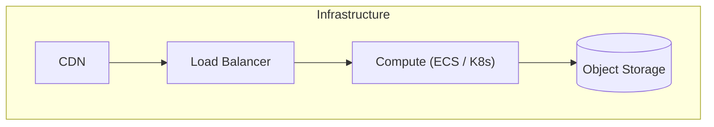

### 4.2 Platform Layer

Document every shared platform service the application depends on. For each
platform component, record:

- **Component**: name and type (relational database, document store, message
  queue, vector store, object store, identity provider, observability stack,
  cache).
- **Responsibility**: what capability it provides.
- **Version and configuration**: version, edition, significant configuration
  choices.
- **Managed vs self-hosted**: whether the team operates it or delegates to a
  provider.
- **Environment segmentation**: how production and non-production instances are
  separated.
- **Encryption at rest**: whether data is encrypted at rest, the encryption
  mechanism (platform-managed keys, customer-managed keys, application-level
  encryption), and the key management approach.
- **Access control**: how application and human access to the platform service
  is authenticated and authorized. State whether credentials are
  per-environment, per-service, or shared. State how credentials are stored
  and rotated.
- **Audit logging**: whether the platform records access and mutation events,
  and where those logs are stored.

Apply the platform segmentation rules from the environment process:

- Default: one production platform instance, one non-production platform
  instance.
- Segment development and test within the non-production instance at the
  schema, namespace, collection, queue, topic, bucket, or prefix level when the
  platform supports safe logical separation.
- Add additional platform instances only for a recorded reason: hard isolation,
  incompatible versions, capacity, security, or production-rehearsal fidelity.

Record the reason if additional instances are needed.

Produce a platform diagram when two or more platform services exist:

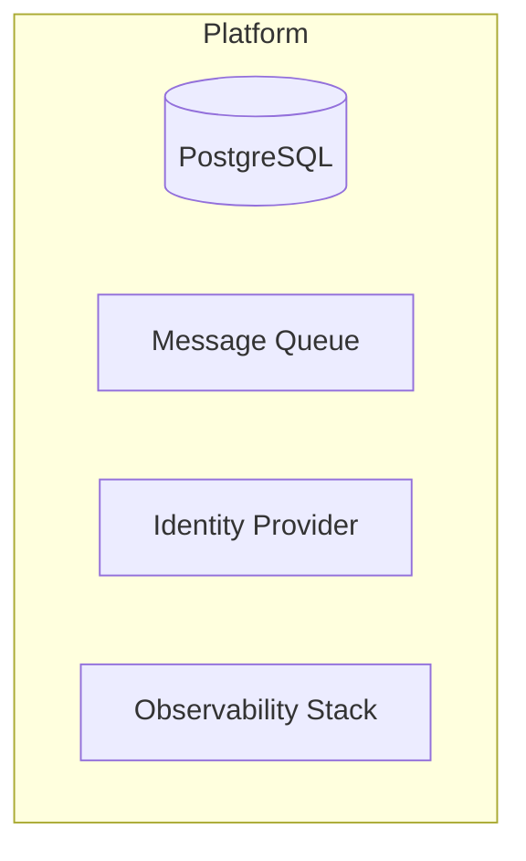

### 4.3 Application Layer

This is the core of most architecture documents. Document every product-owned
deployable unit, job, script, API, and tool.

For each application component, record:

- **Component**: name and type (web service, API, background worker, scheduled
  job, CLI tool, script, agent, adapter, gateway).
- **Responsibility**: what it does, stated as a single concern. If the
  responsibility statement contains "and" more than once, the component may need
  decomposition.
- **Ownership boundary**: what code, data, and configuration this component
  owns exclusively.
- **Interfaces**: what it exposes (HTTP endpoints, gRPC services, CLI commands,
  event publications) and what it consumes (other services, queues, databases,
  external APIs).
- **Deployment unit**: how it is packaged and deployed (container image, Lambda
  function, static site bundle, npm package, script directory).
- **Communication patterns**: synchronous request/response, asynchronous
  messaging, event-driven, polling, streaming.
- **Authentication and authorization**: how each exposed interface enforces
  identity and permissions. State the authentication mechanism (token
  validation, API key, mTLS, session) and the authorization model (RBAC, ABAC,
  scope-based, policy engine). Every endpoint or command that mutates state
  must have an explicit authorization requirement.
- **Input validation**: where and how untrusted input is validated and
  sanitized. State the validation boundary (API gateway, handler, middleware)
  and what classes of input are validated (request bodies, query parameters,
  headers, file uploads).

Produce an application component diagram. This is the most important diagram in
the document. It must show all application components, their relationships, and
the protocols used between them.

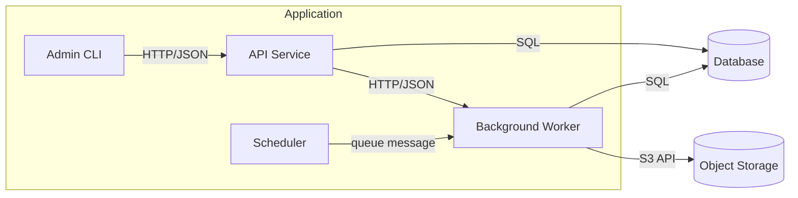

When the application layer is complex, produce additional focused diagrams:

- **Deployment diagram**: shows deployment units and their target environments.
- **Communication flow diagram**: shows request paths for critical user
  journeys.

### 4.4 Data Layer

Document the data the system owns, processes, and exchanges. This is where many
architecture failures originate. Be thorough.

For each data concern, record:

#### Data Classification

Before modeling data, classify every data category the system handles:

| Classification | Definition | Examples | Required controls |
| --- | --- | --- | --- |
| Public | Data intended for public access. | Marketing content, public API responses. | Integrity checks. |
| Internal | Data for internal use, not sensitive. | Application logs, feature flags, config. | Access control, encryption in transit. |
| Confidential | Business-sensitive data. | Financial records, contracts, analytics. | Encryption at rest and in transit, access control, audit logging. |
| Restricted | Highly sensitive or regulated data. | PII, credentials, payment data, health records. | Encryption at rest and in transit, access control, audit logging, key management, retention limits, right-to-erasure support. |

Every entity, field, and data flow documented in this section must reference its
classification. The classification drives encryption, access control, retention,
and audit requirements for that data.

#### Data Model

- **Entities**: core business entities and their relationships. State whether
  the model is relational, document-based, graph, key-value, or hybrid.
- **Data classification per entity**: assign a classification from the table
  above to each entity. When an entity contains fields at different
  classification levels, record the field-level classification for restricted
  and confidential fields.
- **Schema ownership**: which application component owns each schema or
  collection. No schema should be owned by more than one component.
- **Schema contracts**: how consumers access data they do not own (API, event,
  view, materialized projection).
- **Encryption at rest**: state the encryption approach for each data store.
  Restricted and confidential data must be encrypted at rest. Record the key
  management approach.
- **Access control**: state which application components and roles can read and
  write each entity. No entity should be accessible to components that do not
  need it.

Produce a data model diagram showing entities and relationships:

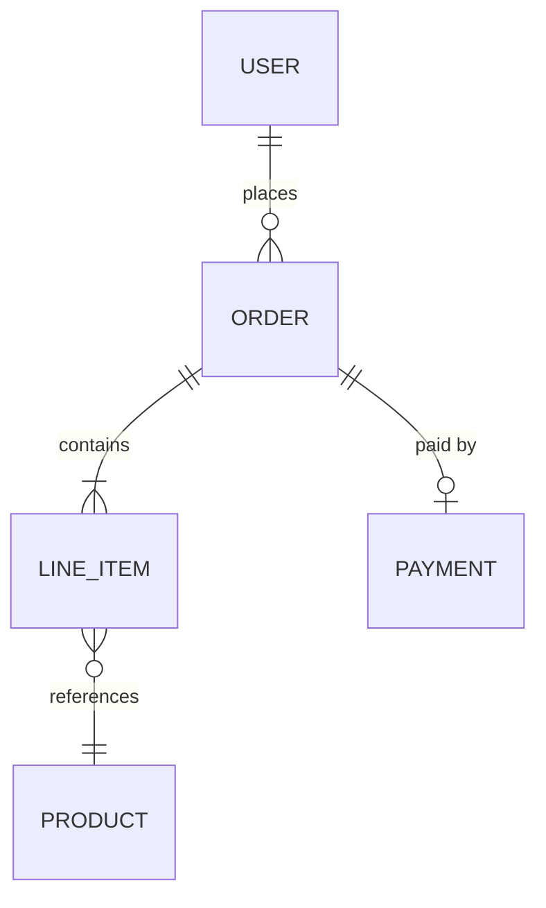

Use `erDiagram` for relational models. Use `graph` for document or event flow
models.

#### Data Flows

Document how data moves through the system. For each significant data flow:

- Source, transformation steps, and destination.
- Sync vs async.
- Volume and frequency expectations.
- Error and retry behavior.

Produce a data flow diagram when the system has more than one data movement
path:

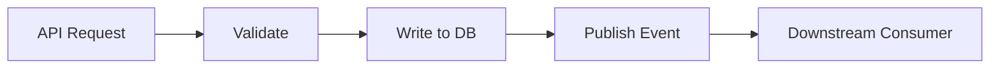

#### Schema Evolution and Migration

- How schema changes are applied (migration tool, manual scripts, platform
  feature).
- Backward compatibility requirements.
- Rollback strategy for failed migrations.
- Data backfill approach when adding non-nullable columns or restructuring.

#### Data Retention and Lifecycle

- Retention policies per data category.
- Archival or purge mechanisms.
- Compliance-driven deletion requirements.

#### Data Provenance

- How the system tracks data origin and transformation history when required by
  the product.

---

## 5. Development Architecture

This section maps every component from section 4 to its physical realization:
what artifacts contain it, where the source lives, how it is built, where
artifacts are stored, how they are deployed, to which environment, and under
what conditions. This is the bridge between the conceptual architecture and
the actual codebase and delivery pipeline.

Every platform, application, and data component documented in section 4 must
appear in this section. If a component cannot be mapped to a concrete artifact,
source location, and deployment mechanism, the architecture is incomplete.

### 5.1 Repository Structure

Document how source code is organized:

- **Repository strategy**: monorepo, multi-repo, or hybrid. State the reason
  for the chosen strategy.
- **Repository inventory**: for each repository, record the name, URL,
  purpose, and what components it contains.
- **Directory structure**: the significant directory conventions within each
  repository. State where application code, tests, configuration,
  infrastructure-as-code, migrations, and documentation live.
- **Code ownership**: which team, role, or individual owns which paths. State
  whether ownership is enforced (CODEOWNERS file, branch protection, review
  requirements).

For multi-repo setups, produce a Mermaid diagram showing the repository
relationships:

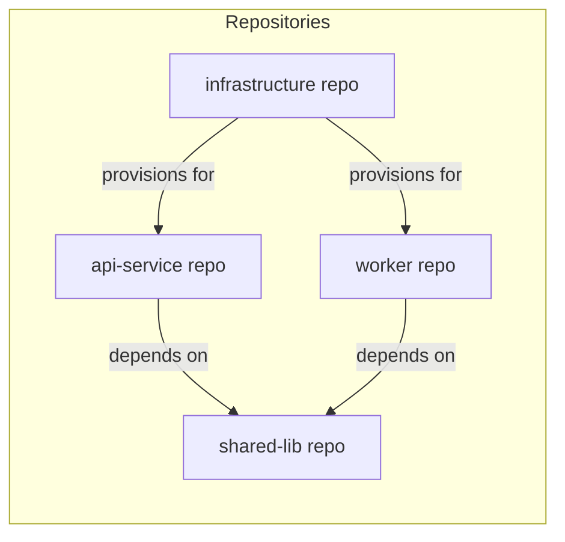

### 5.2 Artifact Inventory

For every component in sections 4.2, 4.3, and 4.4, document the artifact that
contains it:

| Field | Description |
| --- | --- |
| Component | Name from section 4 (e.g., "API Service", "Order Database", "Migration Scripts"). |
| Layer | Infrastructure, platform, application, or data. |
| Source location | Repository and path (e.g., `api-service/src/`). |
| Build mechanism | How source becomes artifact (Dockerfile, webpack, pip build, cargo build, SAM build, Terraform plan, SQL migration tool). |
| Output artifact | What the build produces (container image, static bundle, Python wheel, Lambda zip, Terraform state, migration files). |
| Artifact registry | Where the built artifact is stored (container registry, npm registry, S3 bucket, artifact repository, Git tag). |
| Versioning scheme | How artifacts are versioned (semver, git SHA, date-based, commit count). State how the version is assigned (CI pipeline, manual tag, automatic from commit). |

Example:

| Component | Layer | Source location | Build mechanism | Output artifact | Artifact registry | Versioning |
| --- | --- | --- | --- | --- | --- | --- |
| API Service | Application | `api-service/` | Dockerfile | Container image | ECR `api-service` | Git SHA (short) |
| Background Worker | Application | `worker/` | Dockerfile | Container image | ECR `worker` | Git SHA (short) |
| Order Schema | Data | `api-service/migrations/` | Alembic | Migration files | Bundled in API image | Sequential migration number |
| Infrastructure | Infrastructure | `infra/` | Terraform | Terraform state | S3 `infra-state` | Workspace per environment |
| Shared Library | Application | `shared-lib/` | pip build | Python wheel | Private PyPI | Semver |

Every component from section 4 must appear in this table. If a component has
no distinct artifact (e.g., it is bundled into another component's artifact),
record that relationship explicitly.

### 5.3 Build Pipeline

Document the build pipeline for each artifact:

For each pipeline, record:

- **Pipeline definition location**: where the CI/CD configuration lives
  (e.g., `.github/workflows/api-build.yml`, `Jenkinsfile`, `buildspec.yml`).
- **Trigger**: what starts the pipeline (push to branch, pull request, merge
  to main, manual dispatch, tag creation, schedule).
- **Stages**: ordered list of build stages with what each does.
- **Quality gates**: what checks must pass at each stage before the next
  stage runs (lint, type check, unit tests, integration tests, security scan,
  container scan, coverage threshold).
- **Build dependencies**: what must build or be available before this pipeline
  can run (shared library published, base image available, infrastructure
  provisioned).
- **Build outputs**: what the pipeline produces and where it stores them.
- **Build duration target**: maximum acceptable build time.

Produce a Mermaid diagram for the primary build pipeline:

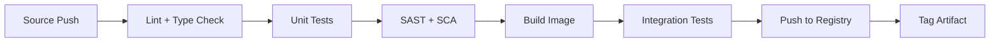

### 5.4 Deployment Architecture

For every artifact, document how it reaches each environment:

#### Environment Inventory

List every environment the system uses:

| Environment | Purpose | Who operates it | Access control |
| --- | --- | --- | --- |
| Local / dev | Developer workstation | Developer | Local credentials |
| Test / staging | QA validation and release rehearsal | Technical Lead | Non-production credentials, scoped per environment |
| Production | Live system | Release / Operations | Production credentials, restricted access |

Add or remove environments to match the actual product. State any additional
environments (sandbox, preview, canary) and their purpose.

#### Deployment Mapping

For each artifact and each target environment, record:

| Field | Description |
| --- | --- |
| Artifact | Name from the artifact inventory. |
| Target environment | Which environment this deployment targets. |
| Deployment mechanism | How the artifact is deployed (Kubernetes apply, ECS service update, Lambda deploy, Terraform apply, S3 sync, manual script). |
| Deployment trigger | What causes deployment (merge to main, tag creation, manual approval, pipeline stage, scheduled). |
| Deployment conditions | What must be true before deployment proceeds (tests passed, artifact built, prior stage deployed, approval gate, change window). |
| Deployment order | Dependencies on other deployments (e.g., "infrastructure must deploy before application", "migrations must run before API restart"). |
| Rollback mechanism | How to undo this deployment (redeploy previous image, revert Terraform, rollback migration). |
| Zero-downtime | Whether this deployment causes downtime and the mechanism that prevents it (rolling update, blue-green, canary). |

Example:

| Artifact | Environment | Mechanism | Trigger | Conditions | Order | Rollback |
| --- | --- | --- | --- | --- | --- | --- |
| API image | Production | ECS rolling update | Merge to `main` | All tests pass, staging validated | After migration | Redeploy previous image tag |
| Migrations | Production | Alembic upgrade | Before API deploy | Staging migration validated | First | Alembic downgrade |
| Infrastructure | Production | Terraform apply | Manual approval | Plan reviewed and approved | Before all others | Terraform apply previous state |
| Static assets | Production | S3 sync + CDN invalidation | After API deploy | API deploy succeeded | After API | Sync previous version |

Produce a deployment flow diagram showing the deployment order and dependencies:

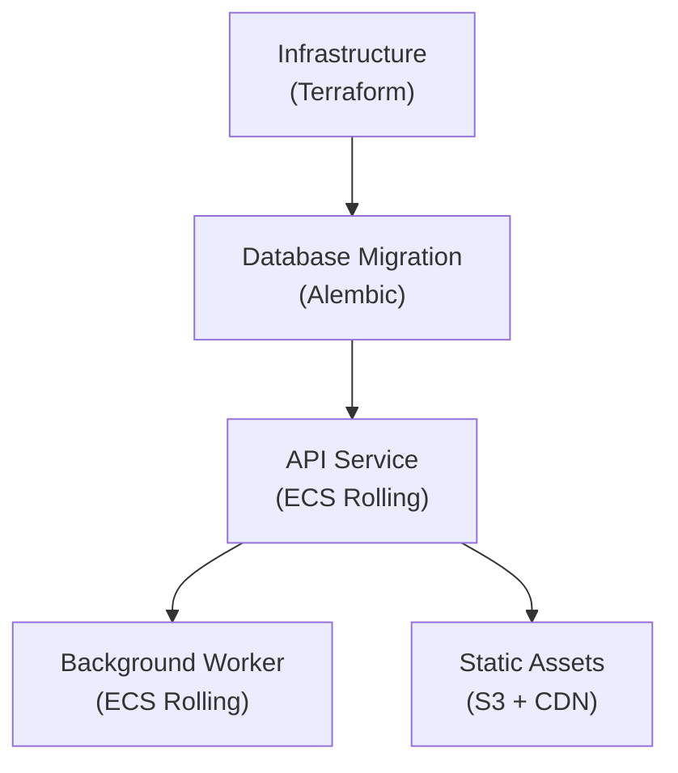

### 5.5 Configuration Management

Document how configuration varies across environments:

#### Configuration Sources

For each environment, state where configuration comes from:

| Source type | Description | Examples |
| --- | --- | --- |
| Environment variables | Injected at runtime by the deployment platform. | `DATABASE_URL`, `LOG_LEVEL`, `FEATURE_FLAG_X` |
| Configuration files | Checked into source control, per-environment variants. | `config/production.yaml`, `config/staging.yaml` |
| Secrets manager | Sensitive values stored in a dedicated secrets service. | AWS Secrets Manager, HashiCorp Vault, GCP Secret Manager |
| Feature flags | Runtime-toggleable configuration. | LaunchDarkly, environment-specific flag sets |
| Infrastructure outputs | Values produced by infrastructure provisioning. | Terraform outputs, CloudFormation exports |

For each configuration value that differs across environments, record:

| Config key | Local/dev | Test/staging | Production | Source |
| --- | --- | --- | --- | --- |
| `DATABASE_URL` | `localhost:5432/dev` | `staging-db:5432/test` | Secrets Manager | Environment variable |
| `LOG_LEVEL` | `DEBUG` | `INFO` | `WARN` | Config file |
| `API_KEY_PAYMENT` | Test key (hardcoded) | Test key (secrets) | Production key (secrets) | Secrets Manager |

#### Secret Management

For each secret the system uses, record:

- **Secret name**: identifier.
- **Purpose**: what it authenticates or protects.
- **Storage**: where the secret is stored (secrets manager, environment
  variable, encrypted file).
- **Injection**: how the secret reaches the runtime (environment variable,
  mounted file, SDK call).
- **Rotation**: the rotation schedule and mechanism (manual, automated,
  triggered by event).
- **Access**: which components and which roles can read the secret.

Secrets must never appear in source code, configuration files committed to
version control, logs, or error messages. State how this is enforced (secret
scanning in CI, log filtering, .gitignore rules).

### 5.6 Version Control Strategy

Document the branching and release model:

- **Branching model**: trunk-based, Git Flow, GitHub Flow, or custom. State
  the model and the reason for choosing it.
- **Branch naming convention**: the pattern for feature branches, release
  branches, and hotfix branches.
- **Merge strategy**: merge commit, squash merge, or rebase. State the policy
  and the reason.
- **Release tagging convention**: how releases are tagged (semver, date-based,
  milestone-based). State what triggers a tag.
- **Branch protection**: what rules are enforced on the main branch (required
  reviews, required status checks, no force push, signed commits).
- **Feature branch lifecycle**: how long feature branches live, when they are
  deleted, how stale branches are handled.

### 5.7 Local Development Environment

Document the local setup a developer needs:

- **Required dependencies**: language runtimes, tools, and their versions.
  State whether a version manager is used (nvm, pyenv, asdf).
- **Local services**: what platform services run locally (database, queue,
  cache) and how (Docker Compose, local install, cloud dev instance).
- **Setup steps**: the exact commands to go from a fresh clone to a running
  local system. State the target setup duration.
- **Local configuration**: how local dev configuration is managed (`.env`
  file, local config override, environment variables).
- **Local credentials**: how developers get non-production credentials for
  local development. State whether credentials are shared, per-developer, or
  auto-provisioned.
- **Local testing**: how developers run tests locally before pushing.

---

## 6. Integration Architecture

Document every integration point where the system communicates with an external
system, third-party service, or independently deployed internal system. Section
2.2 identified these boundaries. This section specifies the contracts and
resilience patterns for each.

### 6.1 Integration Inventory

For each integration, record:

| Field | Description |
| --- | --- |
| External system | Name and owner. |
| Direction | Inbound, outbound, or bidirectional. |
| Protocol | HTTP, gRPC, WebSocket, AMQP, SMTP, file transfer, etc. |
| Encryption in transit | TLS version, certificate validation, mutual TLS when applicable. |
| Authentication | How the systems authenticate to each other (OAuth2, API key, mTLS, HMAC signature). State credential storage and rotation approach. |
| Authorization | What permissions are granted and how they are scoped (read-only, scoped API key, service account with least privilege). |
| Data classification | Classification of data that crosses this boundary. Restricted or confidential data requires encrypted transport and must not appear in logs or error messages. |
| Contract | Link to API spec, schema, or contract definition. |
| SLA | Expected availability, latency, throughput from the external system. |
| Failure mode | What happens when this integration is unavailable. |
| Resilience pattern | Retry, circuit breaker, fallback, dead letter queue, timeout. |

### 6.2 Critical Path Sequences

For each critical user journey that crosses an integration boundary, produce a
sequence diagram:

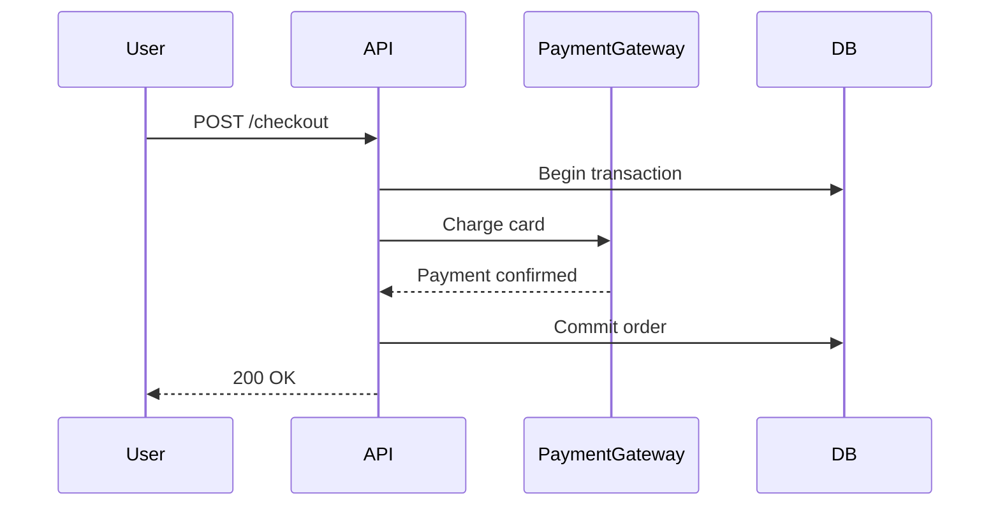

Show the happy path first. Add error paths as separate diagrams or `alt`
blocks when the failure handling is architecturally significant.

### 6.3 Authentication and Authorization Flows

Document how identity and permissions flow across integration boundaries:

- Which system is the identity authority.
- Token format and propagation (JWT, OAuth2 tokens, API keys, mTLS).
- How permissions are evaluated at each boundary.
- Credential rotation and secret management approach.

Produce an auth flow diagram when the product has more than one trust boundary:

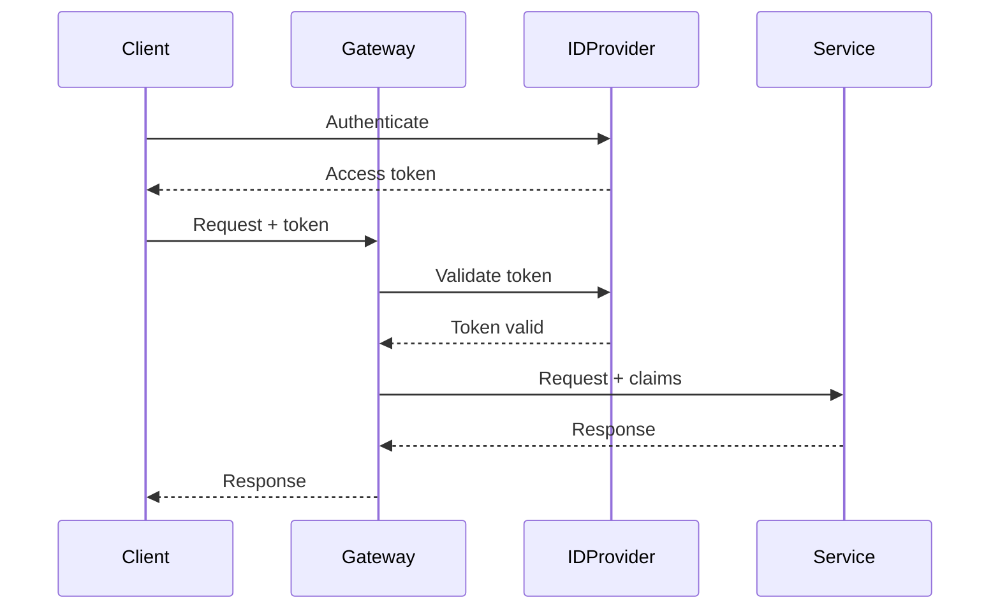

---

## 7. Capability Assessment

Capabilities are quality attributes and operating abilities. Assess them from
three angles: runtime, operations, and development.

For each capability, produce a structured assessment with these fields:

| Field | Description |
| --- | --- |
| Requirement | Concrete, measurable target. Use numbers, thresholds, or explicit pass/fail criteria. Avoid subjective language like "fast" or "highly available." |
| Approach | The architectural mechanism that achieves the requirement. Reference specific components, patterns, or decisions from earlier sections. |
| Risk | What could prevent the requirement from being met. Reference specific failure modes, dependencies, or constraints. |
| Verification | The specific test, metric, or check that proves the requirement is met. Must be executable by a developer or QA agent. |
| Status | `required`, `target`, or `non-goal`. `required` means the system must meet this before release. `target` means best-effort. `non-goal` means the architecture explicitly does not optimize for this; state why. |

Do not list capabilities without filling in all five fields. A capability
assessment that says "should be reliable" without a measurable requirement and a
verification method is not acceptable.

Skip capabilities that are genuinely not material, but record them as `non-goal`
with a one-line justification rather than omitting them silently.

### 7.1 Runtime Capabilities

Assess the following capabilities. Each entry must use the five-field format
above.

**Performance.** State latency targets as percentile thresholds (e.g., p95
< 200ms for the checkout endpoint). State throughput targets as requests per
second or events per second at expected and peak load. Identify the bottleneck
component and the scaling strategy for it.

**Reliability.** State availability as a percentage (e.g., 99.9%) or as
maximum acceptable downtime per month. State the error budget. Define what
counts as an outage. State how the system handles partial failure: which
components can fail independently and which failures cascade.

**Consistency.** State the consistency model per data path. Identify every
path where eventual consistency applies and state the maximum acceptable
propagation delay. Identify every path where strong consistency is required and
state the mechanism that enforces it (transaction, lock, consensus).

**Security.** State the threat model: who are the adversaries, what are their
capabilities, what assets are they targeting. Enumerate attack surfaces: every
endpoint, input channel, and trust boundary. State the controls at each surface
(authentication, authorization, input validation, rate limiting, WAF). State the
secret management approach: where secrets are stored, how they are injected into
the runtime, and the rotation schedule. State whether the system has been or
will be subject to penetration testing or security audit.

**Privacy.** Enumerate every category of personal data the system collects,
with its data classification from section 4.4. State the legal basis for
collection (consent, contract, legitimate interest). State how each category
is stored, who can access it, and how it is deleted on request. State the data
retention period per category.

**Scalability.** State the expected load at launch and at 6/12/24 months.
Identify which resources scale linearly with load and which hit limits. State
the scaling mechanism (horizontal auto-scaling, vertical resize, manual
provisioning) and the trigger thresholds. State the maximum capacity the
current architecture supports without redesign.

**Failure modes.** Enumerate the known failure scenarios. For each: what
triggers it, how it manifests to the user, what the blast radius is, and what
the recovery path is. Include infrastructure failures (host loss, network
partition), platform failures (database outage, queue backup), and application
failures (crash loop, memory leak, deadlock).

### 7.2 Operations Capabilities

The operations capabilities defined in this section are design-time
requirements. They feed the initial operations plan produced by the Architect
per the [Operations Plan Document Specification](operations-plan.md). The
Operations Lead adapts the operations plan to the live production environment
after the first release.

Assess the following capabilities. Each entry must use the five-field format
above.

**Deployability.** State the deployment mechanism (CI/CD pipeline, manual
script, platform feature). State the target deployment frequency (e.g., daily,
per-commit, weekly). State the maximum deployment duration. State whether
deployments are zero-downtime and the mechanism (rolling, blue-green, canary).
State whether deployments can be rolled back and the rollback duration.

**Observability.** State what is logged and at what level (structured JSON,
correlation IDs, request/response bodies for debugging). State the metrics
collected (request rate, error rate, latency percentiles, saturation). State
whether distributed tracing is implemented and the tracing tool. State where
logs, metrics, and traces are stored and their retention period. State the
dashboard location.

**Alerting.** State the alerting conditions with specific thresholds (e.g.,
error rate > 1% for 5 minutes, p99 latency > 2s, disk usage > 80%). State the
notification channel and escalation path. State the expected response time per
severity level.

**Backup and restore.** State what data is backed up, the backup frequency,
the backup retention period, and the storage location. State the recovery time
objective (RTO) and recovery point objective (RPO) as concrete durations. State
whether restore has been tested and the last test date.

**Rollback.** State how application rollback is performed and the duration.
State which data changes are reversible after rollback and which are not. State
the rollback procedure for schema migrations.

**Incident response.** State the runbook location for common failure
scenarios. State who is on call and the rotation schedule. State the
communication protocol during incidents.

**Security operations.** State how security patches are applied and the target
patching cadence. State how vulnerabilities are detected (dependency scanning,
container scanning, runtime detection). State the process for security incident
response: detection, containment, eradication, recovery, and post-mortem. State
how access to production systems is controlled and audited.

**Cost.** State the primary cost drivers. State how cost scales with load.
State the monthly cost ceiling and the alerting threshold for cost anomalies.

### 7.3 Development Capabilities

Assess the following capabilities. Each entry must use the five-field format
above.

**Maintainability.** State the module boundaries and the dependency direction
rules between them. State the maximum acceptable coupling between components
(e.g., no circular dependencies, no cross-boundary database access). State the
code organization conventions.

**Testability.** State the testing strategy: which test types are used (unit,
integration, contract, e2e, load, security), what each type covers, and the
coverage targets. State how tests are run locally and in CI. State the
maximum acceptable CI pipeline duration.

**Security testing.** State which security tests are automated: static
analysis (SAST), dependency vulnerability scanning (SCA), dynamic analysis
(DAST), container image scanning. State the tools used and where they run in
the pipeline. State whether secrets detection runs on commits. State the
policy for handling findings (block merge, triage within N days, accept risk
with recorded justification).

**Local development.** State how a developer sets up and runs the system
locally. State the required dependencies and the setup duration target. State
how local development uses non-production credentials and data.

**CI/CD.** State the pipeline stages, quality gates at each stage, and the
build duration target. State what triggers a pipeline run (commit, PR, merge).
State the artifact promotion path from build to production.

**Dependency management.** State how dependencies are tracked, how updates are
detected, and the policy for major version upgrades. State how vulnerability
findings in dependencies are handled and the remediation SLA.

**Code ownership.** State which team or individual owns each module. State how
ownership is enforced (CODEOWNERS file, review requirements, access controls).

---

## 8. Decisions

Record every architecturally significant decision using this format. A decision
is architecturally significant when it affects system structure, quality
attributes, dependencies, or contracts, and when reversing it would require
non-trivial effort.

### Decision Format

Each decision entry must include:

| Field | Description |
| --- | --- |
| ID | Sequential identifier (e.g., `ADR-001`). |
| Title | Short descriptive title. |
| Status | `proposed`, `accepted`, `deprecated`, `superseded`. |
| Context | The situation and forces that create the need for a decision. |
| Decision | What was decided, stated clearly. |
| Rationale | Why this option was chosen over alternatives. |
| Security impact | How this decision affects the security posture: new attack surfaces introduced, trust boundaries changed, encryption requirements, credential implications. State "none" when the decision has no security impact, with a one-line justification. |
| Consequences | What follows from the decision: benefits, costs, risks, and obligations. |
| Alternatives | Other options considered with reasons for rejection. |

Example:

```
ID:           ADR-001
Title:        Use PostgreSQL for transactional data
Status:       accepted
Context:      The product requires ACID transactions for order processing.
              The team has PostgreSQL operational experience. The data model
              is relational with complex joins.
Decision:     Use PostgreSQL as the primary transactional data store.
Rationale:    Relational model fits the domain. Team has operational
              experience. Managed PostgreSQL is available on the target
              cloud platform.
Consequences: Requires migration tooling. Schema changes need backward
              compatibility during rolling deployments. Connection pooling
              required for serverless compute.
Alternatives: - MongoDB: rejected because the data model is relational
                and cross-document transactions add complexity.
              - DynamoDB: rejected because complex joins would require
                denormalization that increases write complexity.
```

For `full` documents, maintain a decision log at the end of the document or in a
separate file within `architecture/`. For `scoped` documents, inline the
decision in the architecture note.

---

## 9. Risks and Open Questions

### 9.1 Risks

For each identified architectural risk, record:

| Field | Description |
| --- | --- |
| Risk | What could go wrong. |
| Severity | Impact if the risk materializes: `high`, `medium`, `low`. |
| Likelihood | Probability of occurrence: `high`, `medium`, `low`. |
| Mitigation | What the architecture does to reduce severity or likelihood. |
| Contingency | What the team does if the risk materializes despite mitigation. |
| Owner | Who is responsible for monitoring and acting on this risk. |

Do not list risks that have no bearing on architectural decisions. Every risk
listed must connect to a component, capability, integration, or decision
documented earlier in this document.

### 9.2 Open Questions

Record questions that require resolution before or during implementation. Each
question must include:

- The question itself.
- Why it matters architecturally.
- Who can answer it.
- What the architect assumes in the absence of an answer.

### 9.3 Follow-Up Architecture Work

Record architecture work that is identified but deferred. Each entry must state
what the work is, why it is deferred, and what triggers the need to complete it.

---

## 10. Implementation and Verification

This section bridges architecture into development and QA. It translates
architectural decisions into actionable constraints.

### 10.1 Developer Implementation Constraints

State what the developer must follow during implementation. Each constraint must
reference the architectural decision, principle, or component that motivates it.

Each constraint must reference the architectural decision, principle, or
component that motivates it. Security constraints are not optional — every
architecture document must include implementation constraints for
authentication, authorization, input validation, and secret handling when the
product handles any non-public data.

Examples of implementation constraints:

- All database queries must go through the repository layer, not direct SQL in
  handlers (motivated by ADR-003 and the ownership boundary principle).
- External API calls must use the circuit breaker wrapper (motivated by the
  resilience pattern for the payment integration).
- Configuration must not contain hardcoded environment names (motivated by the
  explicit environment targeting pattern).
- Every endpoint that mutates state must enforce authorization before processing
  (motivated by the fail-closed principle and the security capability
  assessment).
- Secrets must not appear in logs, error messages, or API responses. Use
  structured logging with a deny-list for sensitive field names (motivated by
  the data classification in section 4.4).
- User-supplied input must be validated at the API boundary before reaching
  business logic (motivated by the input validation requirement in section
  4.3).

### 10.2 QA Verification Expectations

State what QA must validate from an architecture perspective. These are in
addition to functional acceptance criteria.

Security verification expectations are not optional — every architecture
document must include verification expectations for authentication,
authorization, and data protection when the product handles non-public data.

Examples of verification expectations:

- Verify that the system degrades gracefully when the payment gateway is
  unavailable (expected: user sees a retry prompt, order is not lost).
- Verify that schema migration runs without downtime on a populated test
  database.
- Verify that logs contain correlation IDs for cross-service request tracing.
- Verify that unauthenticated requests to protected endpoints return 401.
- Verify that a user cannot access another user's data through the API.
- Verify that restricted fields (PII, credentials) do not appear in logs or
  error responses.
- Verify that expired or tampered tokens are rejected at every trust boundary.
- Verify that rate limiting activates under simulated abuse load.

### 10.3 Architecture Review on Pull Requests

State the conditions under which the architect must review pull requests for
this product. Reference specific components, boundaries, or contracts that
trigger review.

---

## 11. Scaling Rules

This section defines what is required and what is optional at each scope level,
and how to work with existing artifacts.

### Working With Existing Artifacts

A `full` architecture document does not mean writing from scratch. Most systems
have existing artifacts: READMEs, deployment scripts, configuration files,
inline code comments, previous ADRs, wiki pages, runbooks, CI/CD pipelines,
Terraform or CloudFormation templates, database migration files, and tribal
knowledge. The architect's job is to consolidate, validate, and organize what
already exists — not to reinvent it.

Before writing any section of a `full` document:

1. **Inventory existing artifacts.** List every source of architecture-relevant
   information: documentation files, infrastructure-as-code, deployment
   configurations, CI/CD pipeline definitions, schema migration directories,
   existing ADRs, wiki pages, and onboarding guides. Record the inventory in
   the document's appendix under "Source artifacts."
2. **Assess accuracy.** For each artifact, determine whether its content is
   current, outdated, or contradicted by the actual system state. Mark stale
   artifacts explicitly.
3. **Reference, don't duplicate.** When an existing artifact accurately
   describes a component, integration, or decision, reference it by path or
   URL rather than copying its content. The architecture document provides the
   structural overview and the relationships between artifacts, not a second
   copy of each one.
4. **Fill gaps, not pages.** Write original content only for sections where no
   existing artifact covers the required information, or where existing
   artifacts are inaccurate or incomplete.
5. **Reconcile conflicts.** When existing artifacts contradict each other or
   the observed system state, the architecture document resolves the conflict
   by recording the current truth and marking the stale artifacts for update or
   removal.

When updating an existing `full` document (not creating one for the first time):

- Update only the sections affected by the change.
- Increment the date in the header.
- Add a revision history entry describing what changed and why.
- Verify that referenced artifacts are still accurate.
- Do not rewrite stable sections that are unaffected by the change.

### Full Document Requirements

A `full` architecture design document must include calibrated coverage for all
sections relevant to the selected product model, assurance level, and
architecture scope. Full does not mean maximum depth for every product; it
means durable architecture coverage at the appropriate depth.

| Section | Minimum depth |
| --- | --- |
| 1. Header | All fields including canonical path. |
| 2. Context and Scope | All relevant subsections, including architecture calibration snapshot and model-specific architecture focus. System boundary diagram required when boundaries are non-trivial or trust boundaries exist. |
| 3. Principles and Patterns | Product-specific principles and patterns that materially guide implementation. Prototype work may record only the principles needed to avoid unsafe or irreversible choices. |
| 4. Component Architecture | Affected infrastructure, platform, application, and data boundaries at calibrated depth. Production and enterprise work require explicit security, data, and trust-boundary treatment. |
| 5. Development Architecture | Repository, artifact, build, deployment, configuration, version-control, and local development expectations at calibrated depth. Prototype work may limit this to enough structure to build and run safely. |
| 6. Integration | External boundaries, contracts, credentials, and data crossing points at calibrated depth. Required when the product crosses system boundaries. |
| 7. Capabilities | Runtime, operations, and development capabilities using the five-field format at the selected assurance depth. Prototype work may record only material constraints and explicit deferrals. |
| 8. Decisions | Decisions that materially constrain implementation. At least one decision when architecture alternatives exist. |
| 9. Risks | Risks, open questions, and deferred architecture concerns relevant to the selected assurance level. |
| 10. Implementation | Developer constraints and QA verification expectations at calibrated depth, including security constraints whenever non-public data, credentials, destructive actions, or trust boundaries are involved. |

### Scoped Document Requirements

A `scoped` architecture note must include:

| Section | Requirement |
| --- | --- |
| 1. Header | Product, scope level, date, canonical path of parent `full` document, related issues. |
| 2. Context and Scope | Changed business context, system boundary, and architecture calibration for this change (must reference the `full` document). Diagram optional. |
| 3. Principles and Patterns | Only principles and patterns relevant to this issue. Must reference the `full` document. |
| 4. Component Architecture | Only affected layers and components. Diagram optional but recommended when boundaries change. Security fields required for affected components. |
| 5. Development Architecture | Only affected artifacts, pipelines, deployments, or configuration. Required when the change introduces a new artifact, modifies the build pipeline, changes deployment behavior, or alters configuration management. |
| 6. Integration | Only affected integrations with security fields. Sequence diagram optional. |
| 7. Capabilities | Only capabilities affected by this issue, using five-field format. Security capability required when the change affects trust boundaries, data access, or authentication. |
| 8. Decisions | At least one decision with context, decision, rationale, security impact, and alternatives. |
| 9. Risks | Risks and open questions relevant to this issue. |
| 10. Implementation | Developer constraints and QA verification expectations for this issue, including security constraints when applicable. |

A `scoped` document that touches a section already covered in a `full` document
must reference the `full` document and state only what changes or what is added.
When a `scoped` note introduces changes that affect the `full` document, it must
flag the `full` document for update (see section 1, Document Lifecycle).

### When to Produce Each Level

Produce a `full` document when:

- The product has no existing architecture documentation.
- The work introduces a new product, service, or major component.
- The work redesigns an existing system or changes its fundamental structure.
- The architect judges that the decisions have durable value beyond one issue.
- Existing architecture documentation is fragmented across multiple artifacts
  and needs consolidation.

Produce a `scoped` document when:

- The work is confined to a single issue or small set of related issues.
- The product already has a `full` document that covers the stable architecture.
- The changes do not alter system boundaries, core data models, or platform
  dependencies.
- The selected product model, assurance level, and architecture scope do not
  require durable full documentation.

Update an existing `full` document when:

- A `scoped` note introduces a decision that changes documented architecture.
- A component, integration, or platform dependency is added or removed.
- A security review, audit, or incident reveals inaccuracies.
- The architect reviews the document and finds stale content.
- Product model, assurance level, architecture scope, or deferred architecture
  concerns change.

When in doubt, use the calibration snapshot to decide. Do not produce maximum
depth by default. Ask or return to the owning role only when ambiguity
materially affects safety, security, data integrity, compliance, production
operation, or downstream implementation.

---

## 12. Mermaid Diagram Standards

All diagrams in architecture documents must use Mermaid syntax. Mermaid renders
natively in GitHub, most markdown tools, and agent-facing documentation
systems.

### Required Diagrams by Section

| Section | Diagram type | When required |
| --- | --- | --- |
| 2.2 System Boundary | System context with trust boundaries (`graph`) | Always for `full`. |
| 4.1 Infrastructure | Infrastructure component (`graph`) | When more than one infrastructure component exists. |
| 4.2 Platform | Platform component (`graph`) | When more than one platform service exists. |
| 4.3 Application | Application component (`graph`) | Always for `full`. |
| 4.4 Data Model | Entity relationship (`erDiagram`) or data model (`graph`) | Always for `full`. |
| 4.4 Data Flow | Data flow (`graph`) | When more than one data movement path exists. |
| 5.1 Repository Structure | Repository relationship (`graph`) | When the system uses multiple repositories. |
| 5.3 Build Pipeline | Build pipeline flow (`flowchart`) | Always for `full`. |
| 5.4 Deployment Architecture | Deployment flow (`flowchart`) | Always for `full`. |
| 6.2 Critical Paths | Sequence (`sequenceDiagram`) | At least one critical path for `full`. |
| 6.3 Auth Flow | Auth sequence (`sequenceDiagram`) | When more than one trust boundary exists. Always for `full` when the product handles restricted or confidential data. |

### Diagram Conventions

**Node shapes:**

| Shape | Meaning | Mermaid syntax |
| --- | --- | --- |
| Rectangle | Application component (service, API, worker). | `["Name"]` |
| Double rectangle | The system under design (in context diagrams). | `[["Name"]]` |
| Stadium | Human actor. | `(["Name"])` |
| Cylinder | Data store (database, object storage, file system). | `[("Name")]` |
| Rounded rectangle | External system or platform service. | `("Name")` |
| Hexagon | Decision point or gateway. | `{{"Name"}}` |

**Edge labels:**

- Every edge must have a label describing the interaction.
- Use the format `"action / protocol"` when the protocol is architecturally
  significant.
- Use the format `"action"` when the protocol is obvious from context.

**Subgraphs:**

- Use `subgraph` to group components by layer, deployment unit, or trust
  boundary.
- Label every subgraph.
- Do not nest subgraphs more than two levels deep.

**Naming:**

- Node IDs use PascalCase: `APIService`, `OrderDB`, `PaymentGateway`.
- Node labels use readable names: `"API Service"`, `"Order Database"`.
- Keep diagrams under 15 nodes. Split into multiple diagrams when a single
  diagram would be cluttered.

**Sequence diagrams:**

- Name participants with short, clear names.
- Show the happy path in the primary diagram.
- Use `alt` blocks for error handling only when the error path is
  architecturally significant.
- Use `note` blocks sparingly for critical clarifications.

---

## Appendices (Optional)

For `full` documents, add appendices when needed:

- **Source artifacts**: inventory of existing documentation, IaC, configs, and
  other artifacts that were consolidated into this document. For each, record
  the path, what it covers, and whether it is current or stale.
- **Glossary**: domain-specific terms used in the document.
- **Reference links**: links to external documentation, API specs, platform
  docs, or standards.
- **Related ADRs**: links to decision records that predate or extend this
  document.
- **Revision history**: dated summary of substantive changes when the document
  evolves over multiple reviews.
