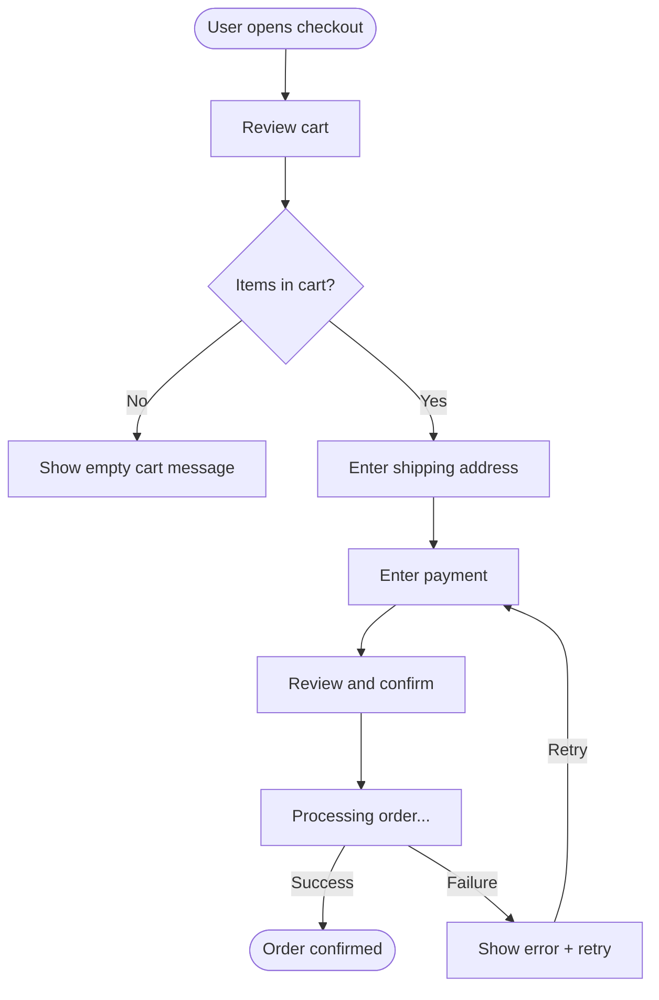
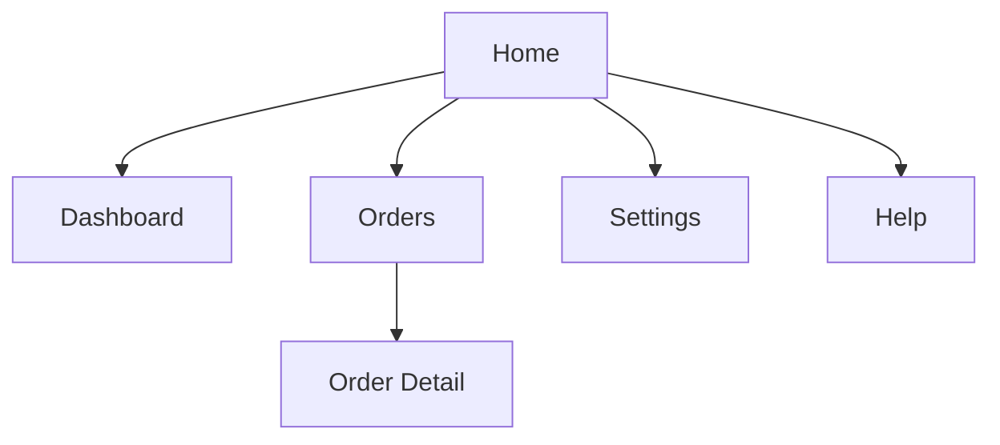
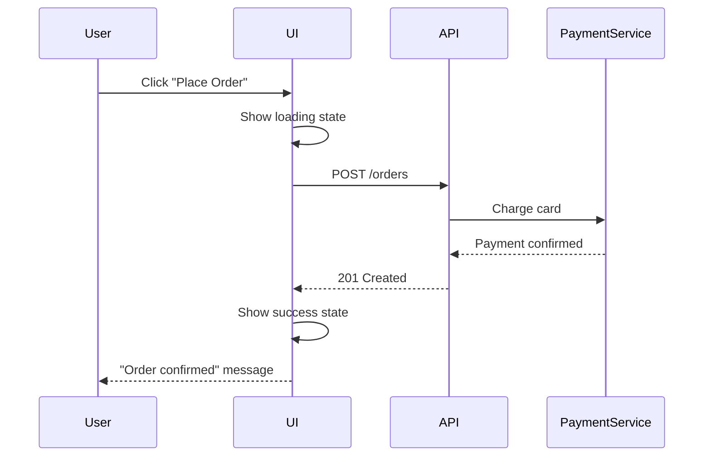

# UX Design Document Specification

This specification defines the standard structure, required content, depth
expectations, and diagram requirements for UX design documents. It is the
authoritative reference the UX Design Lead follows when documenting the
structural user experience for any application.

Every UX design document produced under this process must follow this
specification. The scaling rules define which sections are required and which
are optional based on document scope.

---

## Document Scope Levels

Every UX design document declares one of two scope levels:

| Level | Purpose | Location | When to use |
| --- | --- | --- | --- |
| `full` | Complete structural UX for a product. | `architecture/` or approved product documentation. | New product, major redesign, or first-time UX documentation. |
| `scoped` | Issue-local UX changes. | GitHub Issue comment, pull request, or linked document. | Single-issue UX change where the modification does not warrant a standalone document. |

A `scoped` document may reference a `full` document instead of repeating stable
content. A `scoped` document must never contradict a `full` document without
explicitly recording the override and its rationale.

---

## 1. Document Header

Every UX design document begins with a header containing these fields:

| Field | Required | Description |
| --- | --- | --- |
| Product | Always | Product or application name. |
| Scope level | Always | `full` or `scoped`. |
| Date | Always | Date of last substantive update. |
| Author | Always | Person or agent that produced the document. |
| Status | Always | `draft`, `review`, `accepted`, `superseded`. |
| Canonical path | Always | File path or URL where the authoritative version lives. |
| Related issues | When applicable | GitHub Issue numbers this document covers. |
| Supersedes | When applicable | Document this replaces. The superseded document must be updated to status `superseded` with a pointer to this document. |
| Superseded by | When applicable | Document that replaces this one. |
| Related documents | When applicable | Links to product brief, architecture design document, or other UX documents. |

Example:

```
Product:          Checkout Service
Scope level:      full
Date:             2026-07-03
Author:           UX Design Lead agent
Status:           draft
Canonical path:   architecture/checkout-service-ux.md
Related issues:   #123, #124
Related documents: architecture/checkout-service.md (architecture design)
```

### Document Lifecycle and Canonical Sources

Same rules as the architecture design document specification:

- One canonical location per document, recorded in the header.
- Agents read from the canonical path. Copies are not authoritative.
- Superseded documents are updated with status and pointer, not deleted.
- Incremental updates increment the date and add a revision history entry.
- `scoped` notes that change the `full` document must trigger an update to
  the `full` document.
- Agents verify status is `accepted` before treating content as settled.

---

## 2. Product Context

This section grounds the UX work in the product brief without duplicating it.

### 2.1 Product Brief Reference

Reference the accepted product brief by canonical path or issue number. State
the product's core purpose in one sentence as the UX Design Lead understands
it. Do not copy the product brief.

### 2.2 Target Users

For each user type the product serves, record:

| Field | Description |
| --- | --- |
| User type | Name and role (e.g., "Store manager", "End customer", "API consumer"). |
| Goals | What this user wants to accomplish. Carry from the product brief. |
| Context | Device, environment, frequency of use, expertise level. |
| Constraints | Accessibility needs, connectivity limitations, time pressure, multi-tasking context. |

Do not invent personas beyond what the product brief supports. If the product
brief does not describe users clearly enough, return it to the Product Owner.

### 2.3 Usage Context

Record the environmental factors that shape UX decisions:

- **Primary devices**: desktop, tablet, mobile, or all. State which is primary
  and which are secondary.
- **Connectivity**: always-online, intermittent, offline-first.
- **Usage frequency**: daily tool, occasional use, one-time setup.
- **User expertise**: novice, intermediate, expert. State whether the product
  must accommodate mixed expertise levels.
- **Concurrent usage**: single-user, multi-user on shared data, real-time
  collaboration.

### 2.4 Accessibility Baseline

State the accessibility targets:

- WCAG conformance level: A, AA, or AAA.
- WCAG version: 2.1 or 2.2.
- Assistive technology scope: screen readers, keyboard-only, switch access,
  voice control.
- Legal or compliance obligations that mandate specific accessibility
  standards.

---

## 3. User Flows

Document every user journey the product supports.

### Flow Requirements

For each user flow, record:

| Field | Description |
| --- | --- |
| Flow name | Descriptive name (e.g., "Checkout with saved payment method"). |
| Entry point | Where the user enters the flow (screen, deep link, notification). |
| Completion state | What the user sees when the flow is complete. |
| Steps | Ordered list of steps with decision points and branches. |
| Error paths | What happens when a step fails. How the user recovers. |
| Edge cases | Empty states, first-time use, maximum data, expired sessions, permission denial. |
| Data per step | What data the step displays and where it comes from. |
| Side effects per step | What writes, external calls, or state changes the step triggers. |

### Mermaid Flow Diagrams

Every user flow must have a Mermaid flowchart. Use `flowchart TD` (top-down)
for most flows. Use `flowchart LR` (left-right) when the flow is strictly
linear.



Conventions:

- Use `(["text"])` (stadium shape) for entry and completion states.
- Use `{"text"}` (diamond) for decision points.
- Use `["text"]` (rectangle) for steps.
- Label every edge with the trigger or condition.
- Show error paths explicitly. Do not omit them.

---

## 4. Information Architecture

### 4.1 Screen Inventory

List every screen, view, or page in the product. Organize by hierarchy:

```
Home
├── Dashboard
│   ├── Recent Activity
│   └── Quick Actions
├── Orders
│   ├── Order List
│   ├── Order Detail
│   └── New Order
├── Settings
│   ├── Profile
│   ├── Notifications
│   └── Security
└── Help
    ├── Documentation
    └── Contact Support
```

For each screen, record:

- **Screen name**: descriptive, unique identifier.
- **Purpose**: one sentence stating what the user does here.
- **Parent**: the screen this is navigated from.
- **Entry paths**: all ways to reach this screen (nav, deep link, redirect,
  notification).
- **Primary content**: the main information or action on this screen.

### 4.2 Navigation Model

Define the navigation structure:

- **Global navigation**: elements visible on every screen (header nav, sidebar,
  bottom tabs).
- **Contextual navigation**: elements that appear within specific sections
  (sub-tabs, breadcrumbs, back buttons).
- **Deep linking**: which screens are directly addressable by URL.
- **Navigation state**: what state is preserved when navigating away and back
  (scroll position, form data, filter selections).

Produce a Mermaid sitemap diagram:



### 4.3 Content Priority

For each screen, record content priority:

| Priority | Description |
| --- | --- |
| Primary | The main purpose of the screen. What the user came here to see or do. |
| Secondary | Supporting information or actions that help the user complete the primary task. |
| Tertiary | Navigation, metadata, or rarely-used actions. |

---

## 5. Wireframes

### Wireframe Requirements

For each screen in the screen inventory, produce an annotated wireframe.

Wireframes must be structural, not decorative. They define content zones,
spatial relationships, and content hierarchy. They do not define colors, fonts,
imagery, or brand expression.

For each wireframe, record:

#### Layout Structure

Use ASCII grids or structured descriptions to show spatial relationships:

```
+--------------------------------------------------+
| [GLOBAL NAV]                          [User Menu] |
+--------------------------------------------------+
| [BREADCRUMB: Home > Orders > #1234]               |
+--------------------------------------------------+
|                                                    |
| [PAGE TITLE: Order #1234]          [STATUS: pill]  |
| [SUBTITLE: Placed on 2026-07-01]                   |
|                                                    |
| +------------------------+ +---------------------+ |
| | SECTION: Items         | | SECTION: Summary    | |
| | [Table: item rows]     | | [Total]             | |
| |                        | | [Tax]               | |
| |                        | | [Shipping]          | |
| |                        | | [Grand Total]       | |
| +------------------------+ +---------------------+ |
|                                                    |
| +------------------------------------------------+ |
| | SECTION: Shipping Address                       | |
| | [Address block]                                 | |
| +------------------------------------------------+ |
|                                                    |
| [ACTION: Cancel Order]  [ACTION: Contact Support]  |
+----------------------------------------------------+
```

#### Element Annotations

For each element in the wireframe:

| Element | Data source | Interaction | States |
| --- | --- | --- | --- |
| Page title | `order.id` | None (display only) | — |
| Status pill | `order.status` | None (display only) | pending, processing, shipped, delivered, cancelled |
| Items table | `order.lineItems[]` | Row click → item detail | loading, empty ("No items"), populated |
| Cancel Order button | — | Click → confirmation dialog → POST cancel | default, hover, disabled (if not cancellable), loading |
| Grand Total | `order.total` (computed) | None | — |

Every interactive element must have:

- **Trigger**: what the user does (click, tap, hover, focus, swipe, type).
- **Action**: what happens (navigate, submit, toggle, expand, dismiss).
- **Feedback**: what the user sees (loading state, success message, error
  message, animation).
- **Resulting state**: what the screen looks like after the action.

#### Interaction States

Document all states for every screen. At minimum:

| State | Description |
| --- | --- |
| Default | Normal populated view. |
| Loading | Data is being fetched. Show skeleton screen or loading indicator. Describe what the skeleton looks like. |
| Empty | No data exists yet. Show empty state message with guidance on how to create data. |
| Error | Data fetch or action failed. Show error message with recovery action. |
| Success | Action completed. Show confirmation with next steps. |
| Disabled | Action is not available. Show disabled state with tooltip or text explaining why. |

#### Responsive Structure

For each wireframe, state how the layout adapts:

| Breakpoint | Behavior |
| --- | --- |
| Desktop (>1024px) | Side-by-side layout: items table and summary. |
| Tablet (768-1024px) | Stacked layout: summary moves below items. |
| Mobile (<768px) | Single column. Global nav collapses to hamburger. Cancel button becomes full-width. |

State which elements hide at smaller breakpoints and how the user accesses them
(e.g., "secondary actions collapse into a 'More' menu on mobile").

#### Data Bindings

For each data-displaying element, record:

- **Field**: the data field name (e.g., `order.status`).
- **Source**: where the data comes from (API endpoint, local state, computed).
- **Editable**: whether the user can modify it.
- **Format**: display format (date format, currency, truncation rules).
- **Update behavior**: static (loaded once) or live (updates in real-time).

---

## 6. Interaction Specifications

For each interactive pattern in the product, produce a detailed specification.
Group by pattern type.

### 6.1 Form Interactions

For each form:

| Field | Specification |
| --- | --- |
| Fields | List every field with type (text, email, select, checkbox, file upload, etc.), required/optional, and constraints (max length, regex, allowed values). |
| Validation timing | When validation runs: on blur, on submit, on keystroke. State per field if they differ. |
| Error display | Where errors appear (inline below field, summary at top, toast notification). Error message content for each validation rule. |
| Submission flow | What happens on submit: button state (loading), request sent, success response, error response. |
| Draft saving | Whether the form auto-saves drafts and the mechanism (interval, on blur, on navigation). |
| Multi-step forms | Step indicator, step navigation (back/forward), what state is preserved between steps. |

### 6.2 Navigation Interactions

For each navigation pattern:

| Field | Specification |
| --- | --- |
| Trigger | What initiates navigation (link click, button click, gesture, programmatic redirect). |
| Transition | What the user sees during navigation (instant, fade, slide, loading screen). |
| State preservation | What state is preserved when navigating away and returning (scroll position, form data, filter selections, sort order). |
| Deep linking | Whether the resulting view is addressable by URL and what URL parameters it accepts. |
| History behavior | Whether the navigation adds a history entry (back button works) or replaces the current entry. |

### 6.3 Feedback Patterns

For each feedback pattern:

| Pattern | Specification |
| --- | --- |
| Loading | Where the loading indicator appears, what type (spinner, skeleton, progress bar), when it appears (immediately or after a delay), and what content is visible during loading. |
| Success | How success is communicated (toast, inline message, redirect, state change), duration of visibility, and dismissal behavior. |
| Error | Error message content, display location, persistence (dismissible or persistent until fixed), and recovery action. |
| Confirmation | When confirmation is required (destructive actions, irreversible changes), dialog content, button labels, and default focus. |

### 6.4 Real-Time Interactions

For each element that requires live data:

| Field | Specification |
| --- | --- |
| Element | Which UI element updates in real-time. |
| Data source | What data drives the update. |
| Update mechanism | Push (WebSocket, SSE), polling (interval), or on-demand (user refresh). |
| Update frequency | How often the data changes and the maximum acceptable staleness. |
| Visual treatment | How the user knows data has changed (highlight, animation, counter badge). |
| Conflict resolution | What happens if the user is editing data that changes server-side during the edit. |

### 6.5 Offline Interactions

For each interaction that may occur without connectivity:

| Field | Specification |
| --- | --- |
| Interaction | What the user is doing. |
| Offline behavior | Works normally, queues for later, or blocks with explanation. |
| Queue visibility | If queued: how the user sees pending actions and their status. |
| Sync behavior | How queued actions are sent when connectivity returns. Conflict resolution strategy. |
| Offline indicator | How the user knows they are offline (banner, icon, toast). |

---

## 7. Accessibility Specification

### 7.1 Keyboard Navigation

For each screen, document the tab order:

```
Tab order for Order Detail screen:
1. Skip to main content link
2. Global nav: Home, Orders, Settings, Help
3. User menu
4. Breadcrumb links
5. Items table rows (arrow keys within table)
6. Cancel Order button
7. Contact Support button
```

Document focus traps:

- Which elements trap focus (modals, drawers, dropdown menus).
- How the user exits the trap (Escape key, close button).
- Where focus returns after the trap is released.

Document keyboard shortcuts:

| Shortcut | Action | Scope |
| --- | --- | --- |
| `/` | Focus search | Global |
| `Escape` | Close modal/drawer | When modal is open |
| `Ctrl+Enter` | Submit form | When form is focused |

### 7.2 Screen Reader Support

For each screen, document the landmark structure:

```html
<header>    — Global navigation, logo, user menu
<nav>       — Primary navigation
<main>      — Page content
  <section> — Items section (aria-labelledby heading)
  <section> — Summary section (aria-labelledby heading)
  <section> — Shipping section (aria-labelledby heading)
<footer>    — Page actions, support links
```

Document live regions:

| Region | Content | Priority |
| --- | --- | --- |
| Order status | Announces when status changes | `aria-live="polite"` |
| Form errors | Announces validation errors on submit | `aria-live="assertive"` |
| Toast notifications | Announces success/error messages | `aria-live="polite"` |

Document announcement patterns:

- What the screen reader announces when a modal opens ("Dialog: Confirm
  cancellation").
- What the screen reader announces after form submission ("Order cancelled
  successfully" or "Error: unable to cancel order").
- How table content is navigated and announced.

### 7.3 Focus Management

For each dynamic content change, document where focus moves:

| Event | Focus target | Reason |
| --- | --- | --- |
| Modal opens | First focusable element in modal | User needs to interact with modal content. |
| Modal closes | Element that triggered the modal | User returns to their previous context. |
| Route change | Page heading or skip link | User needs to orient to new content. |
| Inline error on submit | First field with an error | User needs to fix the error. |
| Item deleted from list | Next item in list, or empty state message | User needs a valid focus target. |

### 7.4 Non-Color Indicators

For each status or state communicated through color, document the non-color
alternative:

| Visual indicator | Color | Non-color alternative |
| --- | --- | --- |
| Order status: pending | Amber | Amber pill + text "Pending" + clock icon |
| Validation error | Red border | Red border + error icon + error text below field |
| Success message | Green | Green background + checkmark icon + text |
| Disabled button | Grey | Grey + reduced opacity + `cursor: not-allowed` + tooltip "Cannot cancel a shipped order" |

### 7.5 Touch Targets and Motion

Touch targets:

- Minimum interactive element size: 44x44px (WCAG 2.5.8).
- Minimum spacing between adjacent touch targets: 8px.
- State which elements are smaller than 44px and the mitigation (increased
  padding, touch target area larger than visible element).

Motion:

- List every animation in the product.
- For each, describe the reduced-motion alternative (instant transition, no
  animation, static indicator instead of animated one).

---

## 8. Design-to-Architecture Bridge

This section exists to feed the Architect. The UX Design Lead populates it;
the Architect reads it alongside the product brief when producing the
architecture design document.

### 8.1 Data Requirements Inventory

For each screen, list every data entity the UI needs:

| Screen | Entity | Operations | Fields displayed | Fields editable |
| --- | --- | --- | --- | --- |
| Order List | Order | Read (list, filter, sort) | id, status, date, total, customer name | None |
| Order Detail | Order | Read, Update (cancel) | All fields | None (cancel is a status change) |
| Order Detail | LineItem | Read | name, quantity, price | None |
| New Order | Order | Create | — | customer, items, shipping address, payment |

### 8.2 Real-Time Requirements Inventory

| Element | Data | Update frequency | Acceptable staleness | Mechanism hint |
| --- | --- | --- | --- | --- |
| Order status on detail page | `order.status` | On change | <5 seconds | Push preferred |
| Order list count badge | `orders.count` | Every 30 seconds | 1 minute | Polling acceptable |

The "Mechanism hint" column is a suggestion, not a prescription. The Architect
decides the technical mechanism.

### 8.3 Offline Requirements Inventory

| Interaction | Offline behavior | Sync on reconnect | Conflict strategy |
| --- | --- | --- | --- |
| View order detail | Show cached version if previously loaded | Refresh on reconnect | Server wins |
| Create new order | Queue locally | Submit on reconnect | Fail if conflicting server state |
| Browse order list | Show cached list with offline indicator | Refresh on reconnect | Server wins |

### 8.4 File and Media Handling

| Feature | Type | Max size | Formats | Preview | Processing |
| --- | --- | --- | --- | --- | --- |
| Product image upload | Image | 10MB | JPEG, PNG, WebP | Thumbnail preview before upload | Server-side resize to 3 sizes |
| Invoice download | PDF | — | PDF | Browser PDF viewer | Server-generated |

### 8.5 Authentication Touchpoints

List where authentication and authorization intersect the user experience:

| Touchpoint | UX behavior |
| --- | --- |
| Session expiry | Toast notification + redirect to login. Preserve current URL for post-login redirect. |
| Permission denied | Inline message on the element the user cannot access. Do not hide the element — show it disabled with explanation. |
| Login | Dedicated login screen. Support email/password and SSO. |
| Logout | Confirmation dialog. Clear local cached data. Redirect to login. |

### 8.6 Performance Expectations

| Screen | Perceived load time target | Interaction response target |
| --- | --- | --- |
| Dashboard | <1 second (skeleton visible in <200ms) | — |
| Order List | <1.5 seconds (skeleton visible in <200ms) | Filter/sort: <300ms |
| Order Detail | <1 second | Cancel action: <2 seconds (with loading state) |
| New Order form | <500ms (form shell) | Validation: <100ms. Submit: <3 seconds. |

---

## 9. Scaling Rules

### Full Document Requirements

A `full` UX design document must include all sections:

| Section | Minimum depth |
| --- | --- |
| 1. Header | All fields including canonical path. |
| 2. Product Context | All subsections. User types with goals and context. Accessibility baseline stated. |
| 3. User Flows | Every user journey diagrammed in Mermaid with error paths and edge cases. Data and side-effect annotations per step. |
| 4. Information Architecture | Screen inventory with hierarchy. Navigation model defined. Mermaid sitemap diagram. Content priority per screen. |
| 5. Wireframes | Every screen wireframed with element annotations, all interaction states, responsive structure, and data bindings. |
| 6. Interaction Specifications | Every interactive pattern specified with trigger, action, feedback, and resulting state. Form, navigation, feedback, real-time, and offline patterns covered. |
| 7. Accessibility | Keyboard navigation per screen. Screen reader landmarks and live regions. Focus management for dynamic content. Non-color indicators. Touch targets. Motion alternatives. |
| 8. Bridge | Data requirements, real-time requirements, offline requirements, auth touchpoints, and performance expectations populated. |

### Scoped Document Requirements

A `scoped` UX design note must include:

| Section | Requirement |
| --- | --- |
| 1. Header | Product, scope level, date, canonical path of parent `full` document, related issues. |
| 2. Product Context | Reference the `full` document. State only new user types or changed context. |
| 3. User Flows | Only new or modified flows. Mermaid diagram required for each. |
| 4. Information Architecture | Only new or modified screens. Reference the `full` document for unchanged screens. |
| 5. Wireframes | Only new or modified screens with full annotation depth. |
| 6. Interaction Specifications | Only new or modified interactions. |
| 7. Accessibility | Only accessibility changes for affected screens. |
| 8. Bridge | Only data, real-time, offline, auth, or performance changes. |

### When to Produce Each Level

Produce a `full` document when:

- The product has no existing UX documentation.
- The work introduces a new product or major feature area.
- The work redesigns an existing user experience.

Produce a `scoped` document when:

- The work modifies specific screens or flows in a product with existing UX
  documentation.
- The changes do not alter navigation structure or core user flows.

Update an existing `full` document when:

- A `scoped` note introduces changes that affect the overall UX structure.
- Screens, flows, or navigation patterns are added or removed.
- Accessibility requirements change.

---

## 10. Mermaid Diagram Standards

### Required Diagrams by Section

| Section | Diagram type | When required |
| --- | --- | --- |
| 3. User Flows | Flowchart (`flowchart TD` or `flowchart LR`) | Every user flow for `full`. |
| 4. Information Architecture | Sitemap (`graph TD`) | Always for `full`. |
| 6. Complex interactions | State diagram (`stateDiagram-v2`) | When an interaction has more than 3 states. |
| 6. Multi-step interactions | Sequence (`sequenceDiagram`) | When an interaction involves API calls or multi-system coordination. |

### Diagram Conventions

**User flow diagrams:**

| Shape | Meaning | Mermaid syntax |
| --- | --- | --- |
| Stadium | Entry and completion states. | `(["text"])` |
| Rectangle | Steps. | `["text"]` |
| Diamond | Decision points. | `{"text"}` |
| Rounded rectangle | Sub-processes or referenced flows. | `("text")` |

Label every edge with the user action or condition. Show error paths
explicitly.

**Sitemap diagrams:**

Use `graph TD`. Each node is a screen. Edges represent navigation paths.
Group related screens with `subgraph`.

**State diagrams:**

Use `stateDiagram-v2` for interaction states:

```mermaid
stateDiagram-v2
    [*] --> Default
    Default --> Loading: User clicks submit
    Loading --> Success: Server returns 200
    Loading --> Error: Server returns error
    Error --> Loading: User clicks retry
    Success --> [*]
```

**Sequence diagrams:**

Use for interactions that involve the UI, an API, and possibly other systems:



### General Conventions

- Keep diagrams under 15 nodes. Split complex flows into sub-flows.
- Node IDs use PascalCase: `OrderDetail`, `EmptyCart`, `PaymentForm`.
- Node labels use readable text: `"Order Detail"`, `"Empty Cart"`.
- Use consistent direction within a document (`TD` for hierarchies, `LR` for
  linear flows).

---

## Appendices (Optional)

For `full` documents, add appendices when needed:

- **Source artifacts**: inventory of existing UX documentation, design files,
  or prototypes that were consolidated into this document.
- **Glossary**: domain-specific terms and UX terminology used in the document.
- **Reference links**: links to design system documentation, accessibility
  guidelines, platform-specific interaction guidelines.
- **Revision history**: dated summary of substantive changes.
